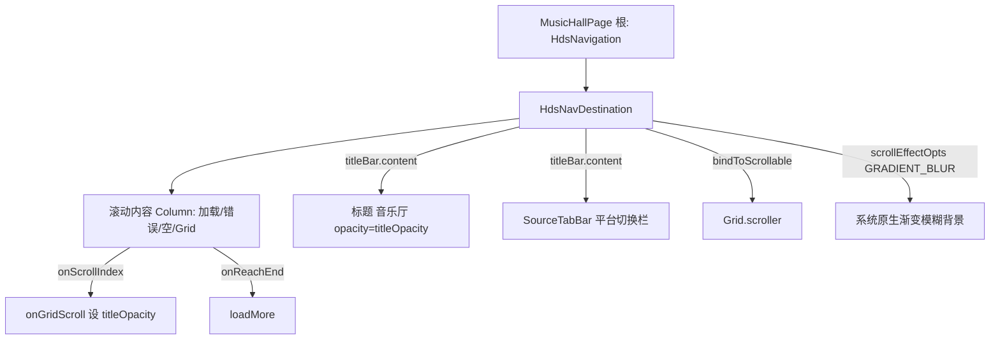

## 用户需求
将音乐厅（MusicHallPage）顶部改为华为官方 HdsNavigation/HdsNavDestination 的**原生渐变模糊**（ScrollEffectType.GRADIENT_BLUR），替换此前手写的 backgroundBlurStyle + linearGradient 模糊层（用户反馈效果差）。

## 产品概述
音乐厅顶部是一块吸顶区域，包含「音乐厅」标题与平台切换栏（SourceTabBar）。改用官方 Hds 组件后，该区域背景在歌单网格滚动时呈现系统原生渐变模糊（顶部清晰、向下渐隐），文字与平台栏保持清晰；上滑后标题渐隐，渐变模糊保留在平台切换栏下方。

## 核心特性
- 顶部整块区域（标题 + 平台栏）应用官方原生渐变模糊，随内容滚动动态生效。
- 歌单网格从模糊标题栏下方穿过（等价官方 barOverlap 的视觉）。
- 上滑超过约一行后「音乐厅」标题透明度渐隐至 0，平台切换栏始终可见、渐变模糊持续覆盖其下方。
- 复用现有加载/错误/空/网格分支与底部栏逻辑，不改动路由与底部栏显隐。


## 技术栈
- HarmonyOS ArkUI（ArkTS，@ComponentV2 / @Local / @Computed）
- UIDesignKit（`@kit.UIDesignKit`）：HdsNavigation、HdsNavDestination，项目已依赖（AreaWithHdsTabBar.ets 已用同 kit 的 HdsTabs / hdsMaterial）
- 模糊能力：HdsNavDestination.titleBar 的 `scrollEffectOpts` + `ScrollEffectType.GRADIENT_BLUR` + `bindToScrollable([scroller])`

## 实现方案
把 MusicHallPage 根容器从手写 `Stack`（LAYER1 内容 + LAYER2 手动模糊浮层）重构为 `HdsNavigation { HdsNavDestination { 滚动内容 } }`。渐变模糊交给官方 titleBar 背景，标题与平台栏放入 titleBar 的 `content` 保持清晰。删除手动 `backgroundBlurStyle` + `linearGradient` 模糊层，规避此前编译/观感问题。

关键技术决策：
1. **自包含 HdsNavigation 作根**：MusicHallPage 在 Index.ets 中是 Swiper 子页（非 NavDestination），外层 Navigation 已 `hideTitleBar(true)`。用自包含 `HdsNavigation` 承载 HdsNavDestination，匹配官方 tab 模式，不受外层 hideTitleBar 影响；若嵌套出现安全区冲突，回退为直接用 `HdsNavDestination` 作根（依赖外层 Navigation 宿主，BottomTabBarExample 即如此）。
2. **bindToScrollable 绑定 Scroller**：官方 6.0.0+ 推荐把可滚动容器 Scroller 绑到导航以获得最佳模糊/显隐体验。Grid 当前无 Scroller，新增 `private scroller: Scroller = new Scroller()` 并 `.scroller(this.scroller)`，同时保留 `.onScrollIndex`（标题渐隐）与 `.onReachEnd`（loadMore）。
3. **渐变模糊参数**：`scrollEffectOpts = { enableScrollEffect: true, scrollEffectType: ScrollEffectType.GRADIENT_BLUR, blurEffectiveStartOffset: 0, blurEffectiveEndOffset: HEADER_HEIGHT }`，渐隐区间对齐顶部高度（约 168vp），观感对齐 GradientBlurTabBar 的 maskHeight≈76。
4. **标题渐隐与平台栏留驻**：titleBar `content` 内放「音乐厅」标题（`opacity = titleOpacity`）与 SourceTabBar；保留 `onGridScroll`（firstIndex>=3 → titleOpacity=0）。平台栏始终在 content 中可见，渐变模糊在滚动时作用于整条标题栏背景（含平台栏下方），满足「上滑后标题隐藏、模糊保留在平台栏下方」。
5. **移除手动模糊层与 HEADER_FADE**：删除 LAYER2 模糊 Stack 与 `backgroundBlurStyle`+`linearGradient`；`HEADER_FADE` 常量不再需要（渐隐由系统 maskHeight 控制），`HEADER_SAFE_TOP/HEADER_TITLE_H/HEADER_TAB_H/HEADER_HEIGHT` 保留用于 content 顶部 padding 与 titleBar content 布局。

## 实现要点
- import 增加 `HdsNavigation, HdsNavDestination`（按需 `HdsUtil`）from `@kit.UIDesignKit`。
- 滚动内容 `Column` 分支保持 `.padding({ top: HEADER_HEIGHT, bottom: 160 })`，使网格从标题栏下方穿过。
- `bindSheet($$this.isTagSheetVisible, this.tagSheetBuilder, {...})` 从旧根 Stack 迁移到新根容器（HdsNavigation 或外层 Column）。
- 保留 `@Consumer() navPathStack`（未使用但属既有声明，不删以免破坏 Provider 注入链路）。
- 模糊强度/渐隐区间若观感需微调，按 `HEADER_HEIGHT` 调整 `blurEffectiveEndOffset`。

## 架构设计

HdsNavDestination 的 titleBar 背景由系统绘制渐变模糊，content（标题+平台栏）为清晰前景层；滚动内容位于标题栏下方，滚动时触发模糊渐变。

## 目录结构
```
features/musichall/src/main/ets/view/
└── MusicHallPage.ets   # [MODIFY] 根布局由手写 Stack 改为 HdsNavigation>HdsNavDestination；新增 Scroller 绑 Grid；titleBar 配 scrollEffectOpts(GRADIENT_BLUR)+content(标题+SourceTabBar)+bindToScrollable；删除手动 backgroundBlurStyle+linearGradient 模糊层；bindSheet 迁移到新根；保留标题渐隐与加载/错误/空/网格分支。
```

## 关键代码结构
```typescript
// MusicHallPage.ets 关键集成点（HdsNavDestination 配置）
HdsNavDestination() {
  // 滚动内容 Column（加载/错误/空/Grid 分支，padding top=HEADER_HEIGHT）
}
.bindToScrollable([this.scroller])
.titleBar({
  content: (): void => {
    // 标题「音乐厅」opacity=this.titleOpacity
    // SourceTabBar({ activeSource, onSourceChange, onFilterClick })
  },
  style: {
    scrollEffectOpts: {
      enableScrollEffect: true,
      scrollEffectType: ScrollEffectType.GRADIENT_BLUR,
      blurEffectiveStartOffset: 0,
      blurEffectiveEndOffset: HEADER_HEIGHT
    }
  },
  padding: { start: ..., end: ... }
})
.hideBackButton(true)
```

