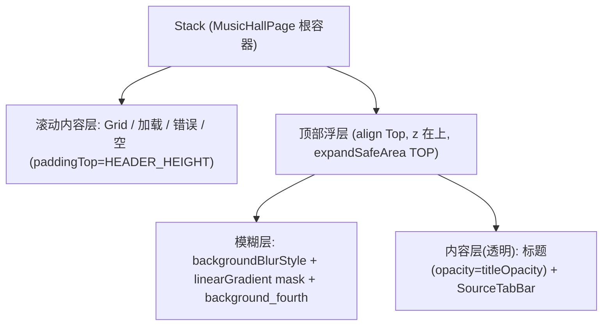

## 用户需求
将音乐厅（MusicHallPage）顶部改造为「渐变模糊（GradientBlur）」效果，参考本地 HarmonyOS 示例 `HarmonyOSComponentUXExamples` 的 `GradientBlurTabBar`。

## 产品概述
在音乐厅页面顶部（「音乐厅」标题 + 平台切换栏 SourceTabBar 整块区域）实现沉浸式渐变模糊顶栏：歌单网格滚动时从模糊层下方穿过，模糊在底部边缘渐隐；上滑后标题隐藏，渐变模糊仍保留在平台切换栏下方。

## 核心特性
- 顶部整块（标题 + 平台切换栏）作为吸顶浮层，背景为渐变模糊（非均匀背板模糊）。
- 模糊带在浮层底部边缘渐隐（复刻示例 maskHeight≈76vp），着色用 `background_fourth`。
- 歌单网格（含加载/错误/空状态）从浮层下方滚动穿过，形成毛玻璃穿透观感。
- 保留「上滑后标题渐隐」逻辑；标题隐藏后渐变模糊保留在平台栏下方。
- 底部 MiniPlayerBar + LucidTabBar 不受影响，与现有 Index.ets 管理保持一致。


## 技术栈选择
- 平台：HarmonyOS ArkUI（ArkTS），`@ComponentV2` / `@Local` / `@Computed` 状态管理。
- 复用：现有 `MusicHallPage.ets`、`SourceTabBar.ets`，不引入新依赖、新三方库。
- 模糊能力：ArkUI 原生 `backgroundBlurStyle` + `.mask(LinearGradient)` 手动复刻 `Tabs.barBackgroundStyle` 的渐变模糊（因 `barBackgroundStyle` 是 Tabs 专属 API，顶部无 Tabs，需等价复刻）。

## 实现方案
**策略**：把 `MusicHallPage` 根 `Column` 重构为 `Stack`——下层是可滚动内容（Grid/加载/错误/空），上层是吸顶顶部浮层。浮层由「模糊背景层」+「清晰内容层」两层 `Stack` 组成：模糊层用 `backgroundBlurStyle(BlurStyle.BACKGROUND_BLUR, ...)` 模糊其背后滚动的网格内容，叠加 `backgroundColor($r('sys.color.background_fourth'))` 着色，并用 `.mask(LinearGradient)` 在底部边缘由不透明渐变到透明（复刻 `maskHeight` 渐隐）；内容层（透明背景）放置标题（`opacity=titleOpacity`，保留滚动渐隐）与 `SourceTabBar`，渲染在模糊层之上保持清晰。滚动内容顶部加 `padding({ top: HEADER_HEIGHT })`，使其初始位于浮层下方、滚动时从模糊层后方穿过（等价 `barOverlap(true)`）。

**关键决策**：
1. 用 `backgroundBlurStyle` + 渐变 `mask` 而非 `barBackgroundBlurStyle`：后者是示例里被用户明确否定的「背板模糊（均匀模糊）」；前者加渐变遮罩后即为「渐变模糊」，正是 `GradientBlurTabBar.barBackgroundStyle` 的等价效果。
2. 浮层用 `Stack` 双层而非单层：单层直接给内容加模糊会让标题文字也被模糊；分离模糊层与内容层，文字保持清晰、仅背景毛玻璃。
3. 保留标题 `opacity` 渐隐、但不再折叠 `height`：避免浮层高度跳动导致平台栏位置抖动；标题区域高度常驻（不可见），渐变模糊覆盖整块浮层。

**性能与可靠性**：`backgroundBlurStyle` 每帧对背后内容做实时模糊，开销随浮层面积增大而上升；将浮层高度限制在顶部（HEADER_HEIGHT 约 150–170vp）而非全屏，控制模糊区域。滚动通过现有 `Grid.onScrollIndex` 驱动 `@Local` 状态变更，沿用既有节流（firstIndex>=3 触发），不引入额外滚动监听。

## 实现注意事项
- 复用现有 `onGridScroll`（firstIndex>=3 → `titleOpacity`/`titleSpace`→0）逻辑，仅将 `titleSpace` 用于浮层/内容 padding 估算，不再直接折叠标题高度。
- `bindSheet` 继续挂在根容器上，不受 Stack 重构影响。
- 浮层加 `expandSafeArea([SafeAreaType.SYSTEM],[SafeAreaEdge.TOP])` 延伸至状态栏；标题保留安全区上间距（原 `margin({ top: 64 })` 改为浮层内顶部 padding）。
- `HEADER_HEIGHT` 建议定义为常量：`SAFE_TOP(64) + TITLE_H(56) + TAB_BAR_H(~44)`；上滑标题隐藏后浮层高度可动画收缩为 `SAFE_TOP + TAB_BAR_H`，内容 padding 同步动画，保持平滑。
- 模糊强度/渐变长度在实现时对齐示例（`maskHeight`≈76vp）并据观感微调；`BlurStyle` 优先 `BACKGROUND_BLUR`，若观感偏弱可升 `BACKGROUND_THICK`。
- 不改变 `SourceTabBar.ets` 内部实现，仅将其作为浮层内容层子组件放入。

## 架构设计
沿用现有 MusicHallPage 组件结构，仅重构根布局与顶部区域；无新架构模式、无新模块。



## 目录结构
```
features/musichall/src/main/ets/view/
└── MusicHallPage.ets   # [MODIFY] 重构根 Column 为 Stack；新增顶部渐变模糊浮层（模糊层+内容层）；
                        #          滚动内容分支加顶部 padding 从浮层下方穿过；保留 onGridScroll 标题渐隐；
                        #          bindSheet 挂载在根 Stack 上；引入 HEADER_HEIGHT 常量与渐变 mask 配置。
```

## 关键代码结构
```typescript
// 渐变模糊背景层（复刻 GradientBlurTabBar 的 barBackgroundStyle 渐变）
Column() { /* 透明占位，依赖 backgroundBlurStyle 模糊背后滚动内容 */ }
  .width('100%')
  .height(HEADER_HEIGHT)
  .backgroundBlurStyle(BlurStyle.BACKGROUND_BLUR, {
    adaptiveColor: AdaptiveColor.DEFAULT,
    colorMode: ThemeColorMode.AUTO,
    scale: 1
  })
  .backgroundColor($r('sys.color.background_fourth'))   // 等同 maskColor
  .mask(new LinearGradient({
    direction: GradientDirection.Bottom,
    // 顶部不透明、底部透明；渐隐区高度对齐 maskHeight≈76vp
    colors: [[Color.White, 0.0], [Color.White, (HEADER_HEIGHT - 76) / HEADER_HEIGHT], [Color.Transparent, 1.0]]
  }))
```


## 设计风格
采用 HarmonyOS 原生「渐变模糊（毛玻璃）」沉浸顶栏风格，对齐官方 ComponentUXExamples 的 GradientBlurTabBar 观感。顶部整块区域（标题 + 平台切换栏）悬浮于歌单网格之上，背景为半透明磨砂玻璃，模糊在底部边缘柔和渐隐，歌单内容滚动时从玻璃下方穿过，呈现通透的层次感。上滑后标题淡出，仅保留平台栏下方的渐变模糊条，维持沉浸式一致性。

## 布局与交互
- 顶部浮层吸顶，延伸至状态栏安全区；标题区在浮层内顶部，平台切换栏（ChipGroup 胶囊）紧贴其下。
- 浮层模糊层着色取系统 `background_fourth`，底部 76vp 渐隐至透明。
- 歌单 3 列网格初始位于浮层下方，上滑时从毛玻璃后方穿过（实时模糊）。
- 标题随滚动淡出（opacity 动画 200ms），浮层高度可平滑收缩为仅平台栏高度。
- 整体沿用现有深色/浅色主题自适应（`ThemeColorMode.AUTO`）。
