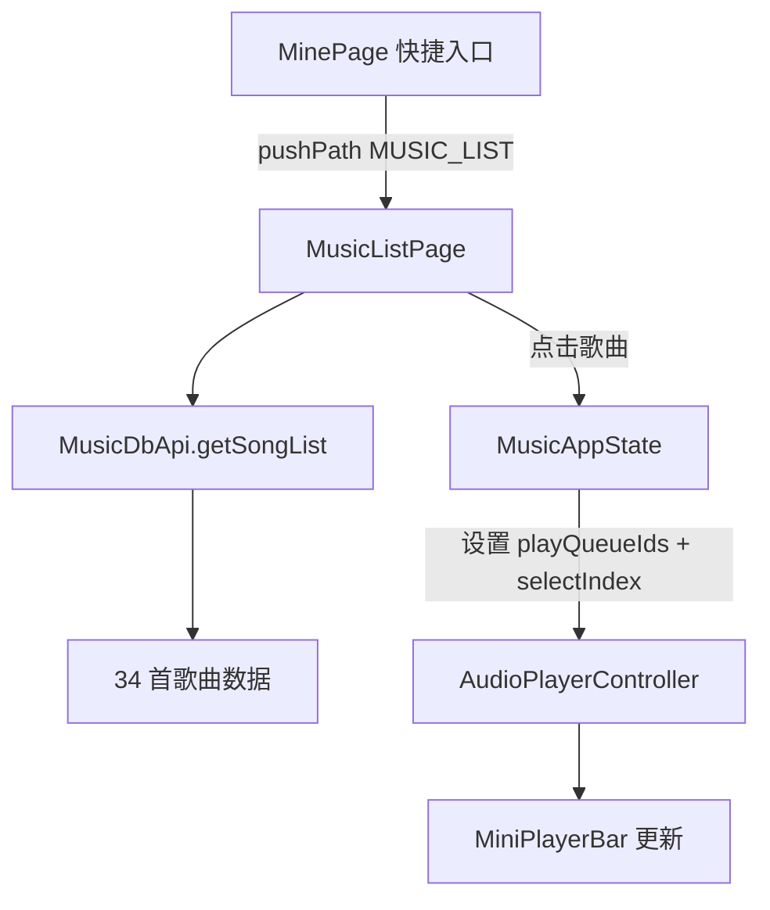

## 产品概述
在"我的"页面中，为三个快捷入口（本地、最近播放、收藏）接入音乐列表页。点击任意入口后进入歌曲列表，展示所有本地歌曲（含 Dream It Possible），点击歌曲即可播放。

## 核心功能
- 快捷入口点击：本地/最近播放/收藏三个卡片分别跳转到音乐列表页，标题按入口类型区分
- 歌曲列表展示：每行显示序号、歌名、歌手，支持滚动浏览 34 首歌曲
- 点击播放：点击列表中任意歌曲，设置播放队列并切换到该歌曲，底部 MiniPlayerBar 响应播放
- 返回按钮：使用与 SettingsPage 一致的 AreaWithHdsTabBar 沉浸光感返回键
- Dream It Possible 已在 rawfile 中（ID=1，标记 VIP），无需额外导入音频文件


## 技术方案

### 新增文件
- `features/mine/src/main/ets/view/MusicListPage.ets` — 音乐列表页组件

### 修改文件
- `common/musicbasic/src/main/ets/constants/Constants.ets` — 新增 `MUSIC_LIST` 路由常量
- `features/mine/Index.ets` — 导出 `MusicListPage`
- `features/mine/src/main/ets/view/MinePage.ets` — 快捷入口添加 `onClick` 导航
- `entry/src/main/ets/pages/Index.ets` — 注册 MusicListPage 的 NavDestination

### 架构设计



### 实现细节

**MusicListPage 设计**：
- 通过 `NavPathInfo.param` 接收入口标题（"本地"/"最近播放"/"收藏"）
- 使用 `AppStorageV2.connect` 获取 `MusicAppState` 实例（参照 PlaybackPage 模式）
- `aboutToAppear` 中调用 `MusicDbApi.getInstance().getSongList()` 获取歌曲列表
- `ListItem` 布局：`序号 | 歌名 + 歌手 | chevron_right`
- 点击歌曲：设置 `appState.playQueueIds` 为当前列表 ID、`appState.selectIndex` 为点击位置
- 返回按钮复用 `AreaWithHdsTabBar` 模式，与 SettingsPage 一致

**MinePage 入口点击**：
- 每个快捷入口 `Column` 添加 `.onClick`，调用 `pushPath` 跳转 MusicListPage
- 通过 `NavPathInfo(name, param)` 传递标题参数

**NavDestination 注册**：
- 使用 `TransitionEffect.OPACITY` + `Color.Transparent` 背景（与现有 Settings 模式一致）
- `onBackPressed` 直接 `pop()`

### 关键代码结构

**MusicListPage 歌曲条目接口**：
```typescript
// NavPathInfo param 类型
interface MusicListParam {
  title: string  // "本地" / "最近播放" / "收藏"
}
```

**MinePage onClick 模式**：
```typescript
.onClick(() => {
  this.navPathStack.pushPath(
    new NavPathInfo(RouterUrlConstants.MUSIC_LIST, { title: entry.label }),
    { animated: false }
  )
})
```

