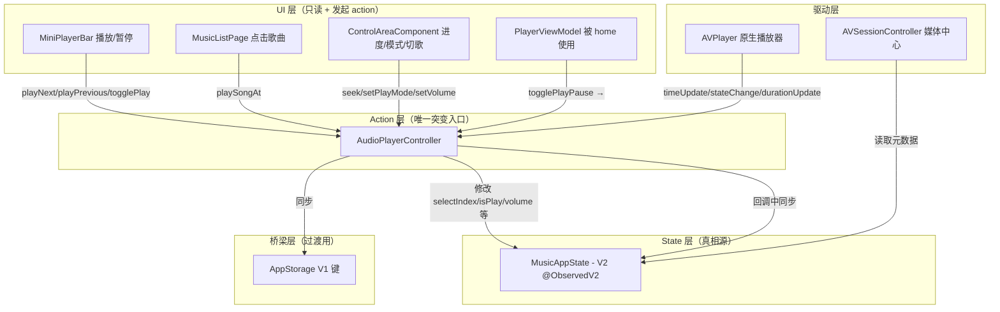

## 用户需求
参考 lx-music-mobile 的 store 架构（state/action/hook 分离，单一可变状态对象 + 事件通知），优化 lucid_music 项目的播放状态管理。当前问题：详细页封面、文字、音频对不上，媒体中心也对不上。用户要求将播放歌曲状态、音源状态集中管理，其他地方只做申请，统一修改（切歌、播放列表、进度、收藏等），详细页和媒体中心只从它读取。

## 核心功能
- 消除 V1 AppStorage 与 V2 MusicAppState 的"双源真相"问题
- 统一 SongItem 定义，删除 features/player 中的重复版本
- 将所有播放状态突变路径收敛到 AudioPlayerController
- 将缺失的播放状态字段（playMode、isFavorite、isSilentMode、currentVolume）加入 MusicAppState
- 修复 PlayerViewModel 直接改状态不触发播放的 bug
- 删除 pendingPlayIndex 等无消费者的 V1 键

## 技术栈
- HarmonyOS ArkUI (TypeScript)
- @ObservedV2 / @Trace（V2 响应式状态管理）
- AppStorageV2.connect / AppStorage.setOrCreate（状态持久化与跨组件通信）

## 实现方案

### 架构策略：参照 lx-music-mobile 但适配现有 V2 基础设施

项目已有良好基础：`MusicAppState`(@ObservedV2) + `AppStorageV2.connect()` + `AudioPlayerController`。核心问题不是缺少 store，而是**突变路径散乱**（4 个不同入口各自改状态）和**双源同步不一致**。因此策略是：

1. **收敛而非重建**：不新建 action/hook 层，而是让 `AudioPlayerController` 成为唯一的"action 层"，所有状态修改通过它的方法进行
2. **V2 为主、V1 为辅**：UI 组件优先通过 `AppStorageV2.connect(MusicAppState)` 消费状态；V1 键仅作为过渡同步桥梁，不做独立写入口
3. **单向数据流**：UI action → AudioPlayerController 方法 → 修改 V2 MusicAppState → AVPlayer 回调同步 V2 → 关键字段同步到 V1（供未迁移的旧组件读取）

### Mermaid 数据流图

### 关键决策

1. **PlayerViewModel 不删除**：它被 home 的 3 个 MiniPlayerBar 组件使用。改为将 togglePlayPause 委托给 `AudioPlayerController.getInstance().togglePlay()`，而不是直接改 `appState.isPlay`
2. **SongItem 统一到 common**：删除 `features/player/viewmodel/SongData.ets`，所有引用改从 `musicbasic` 导入。同时删除重复的 `SongDataSource`
3. **AudioPlayerController 新增方法**：
   - `playSongAt(queueIds: number[], index: number)` — 替代 MusicListPage.onSongTap 的直接写状态
   - `toggleFavorite(songId: number)` — 收藏操作统一入口
   - 现有 `setPlayMode` 补充 V2 同步
4. **V1 清理策略**：不一次性移除所有 V1 键（风险太大），而是在 `PlaybackPage.syncCurrentSongToAppStorage()` 中集中做 V2→V1 单向同步，并在 AudioPlayerController 回调中同步关键字段

### 实现注意事项

- **性能**：`timeUpdate` 高频回调中 V1 `setOrCreate` 保持不变（已有性能 profile），不引入额外开销
- **日志**：复用现有 Logger 模式，在 action 方法入口记录 TAG + 方法名 + 关键参数
- **兼容性**：V1 键保留但不再被任何代码独立写入（仅由 AudioPlayerController 和 PlaybackPage 同步），旧组件仍可读取
- **回退安全**：每阶段变更独立可验证，出问题可单独回退

