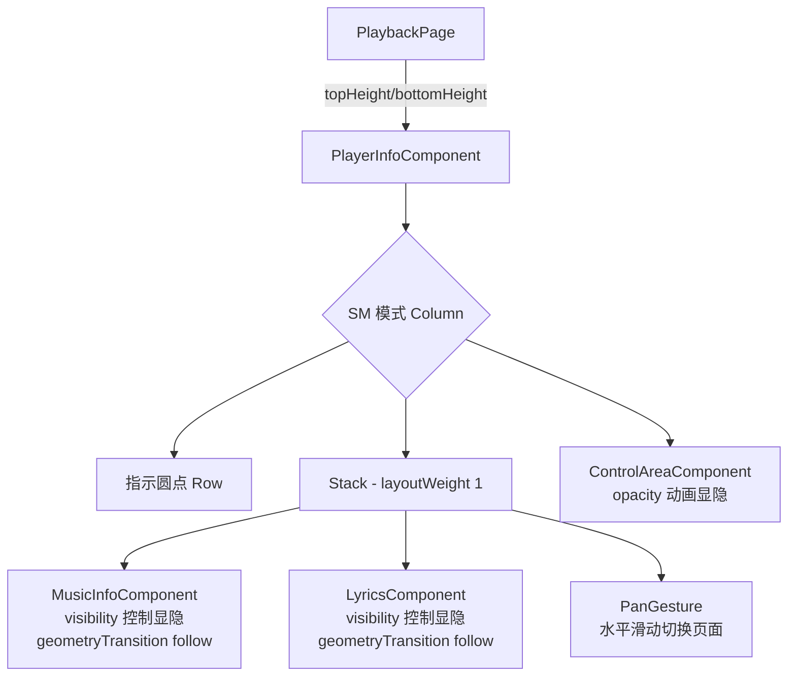

## 用户需求
修复播放页三个问题：
1. **底部控制区域紧贴屏幕边缘**：`PlaybackPage.ets` 中 `bottomHeight` 初始化为 0，没有考虑底部手势导航条的安全高度。
2. **一镜到底动画没有生效**：`geometryTransition` 在 Swiper 内部无法工作，Swiper 的滑动动画会覆盖 geometryTransition 的元素级过渡。需要去掉 Swiper，改用 Stack + visibility 控制两个组件同时挂载，让 geometryTransition 能正常工作。
3. **缺少顶部页面指示器**：对标项目在顶部有 DotIndicator 显示当前是封面页还是歌词页，需要添加。

## 核心功能
- 底部安全距离适配：通过 `WindowUtil.getMainWindowInfo().navigationBarBottomVp` 获取导航条高度
- 封面/歌词切换改为 Stack + visibility 模式，保留 PanGesture 左右滑动手势
- geometryTransition 同步修正：follow 参数从 `swiperIndex` 改为 `showLyrics` 布尔值
- 顶部添加两个小圆点指示器，随页面切换动态变化


## 技术方案

### 1. 修复底部安全距离
**文件：`PlaybackPage.ets`**

将 `bottomHeight` 从 `0` 改为 `WindowUtil.getInstance().mainWindowInfo.navigationBarBottomVp`。需要在 `PlaybackPage.ets` 中引入 `WindowUtil`（从 `musicbasic` 模块导出）。

### 2. 一镜到底动画修复
**核心思路**：Swiper 的滑动动画和 geometryTransition 冲突。Swiper 对两个页面施加整体 translateX 变换，覆盖了 geometryTransition 的单元素位移动画。去掉 Swiper，改为 Stack 内两个组件同时挂载，通过 `visibility` 控制显隐。

**文件：`PlayerInfoComponent.ets` — SM 模式布局重构**

```ets
// 替换前（Swiper）
Swiper() {
  MusicInfoComponent({ swiperIndex: this.swiperIndex })
  LyricsComponent({ swiperIndex: this.swiperIndex, isTablet: this.isTabletFalse })
}
.layoutWeight(1).indicator(false).loop(false)

// 替换后（Stack + visibility）
Stack() {
  MusicInfoComponent({ follow: this.showLyrics })
    .visibility(this.showLyrics ? Visibility.Hidden : Visibility.Visible)
  LyricsComponent({ follow: !this.showLyrics, isTablet: this.isTabletFalse })
    .visibility(this.showLyrics ? Visibility.Visible : Visibility.Hidden)
}
.layoutWeight(1)
.gesture(
  PanGesture({ direction: PanDirection.Horizontal, distance: 80 })
    .onActionEnd((event: GestureEvent) => {
      if (event.offsetX < -50 && !this.showLyrics) {
        this.showLyrics = true;
        this.startControlTimer();
      } else if (event.offsetX > 50 && this.showLyrics) {
        this.showLyrics = false;
        this.resetControlTimer();
      }
    })
)
```

**关键变更**：
- 新增 `@State showLyrics: boolean = false`
- 移除 `@State swiperIndex`，改为 `showLyrics`
- `MusicInfoComponent` 传参从 `{ swiperIndex }` 改为 `{ follow: this.showLyrics }`
- `LyricsComponent` 传参从 `{ swiperIndex }` 改为 `{ follow: !this.showLyrics }`
- PanGesture 水平滑动距离 > 50vp 时触发切换，避免误触
- 定时器逻辑从 `onChange` 回调移至独立的 `startControlTimer()` / `resetControlTimer()` 方法

### 3. 子组件参数适配
**文件：`MusicInfoComponent.ets`、`LyricsComponent.ets`**

将 `@Prop swiperIndex: number = 0` 改为 `@Prop follow: boolean = false`，geometryTransition 的 follow 参数从 `this.swiperIndex !== 0/1` 改为 `this.follow`。

- MusicInfoComponent：`geometryTransition('ID', { follow: this.follow })` — 当 showLyrics=true 时 follow=true（离开封面页）
- LyricsComponent：`geometryTransition('ID', { follow: this.follow })` — 当 showLyrics=false 时 follow=true（离开歌词页）

### 4. 顶部页面指示圆点
在 SM 模式 Column 顶部，Swiper 区域上方添加自定义指示器：

```ets
Row() {
  Circle({ width: 6, height: 6 })
    .fill(this.showLyrics ? '#66FFFFFF' : '#FFFFFFFF')
    .animation({ duration: 300, curve: Curve.EaseInOut })
  Circle({ width: 6, height: 6 })
    .fill(this.showLyrics ? '#FFFFFFFF' : '#66FFFFFF')
    .animation({ duration: 300, curve: Curve.EaseInOut })
    .margin({ left: 8 })
}
.width('100%').justifyContent(FlexAlign.Center)
.margin({ top: 72 + statusBarHeight })
// 放在 Swiper 原来的 margin 位置
```

### 5. 架构流程图



## 修改文件清单

| 文件 | 改动 |
|---|---|
| `PlaybackPage.ets` | bottomHeight 用 WindowUtil 获取导航条高度 |
| `PlayerInfoComponent.ets` | SM 模式：Swiper→Stack+visibility+PanGesture；新增 showLyrics、指示圆点 |
| `MusicInfoComponent.ets` | swiperIndex→follow 参数重命名 |
| `LyricsComponent.ets` | swiperIndex→follow 参数重命名 |

## 实现注意事项
- PanGesture distance 设为 80vp 最小触发距离，onActionEnd 中判断 offsetX 绝对值 > 50vp 触发切换
- 指示圆点颜色用 `#FFFFFFFF`（白不透明）和 `#66FFFFFF`（白半透明），与环境风格一致
- 定时器逻辑封装为独立方法，PanGesture 切换时也调用
- follow 语义：`true` = 该组件正在离开，其元素向目标位置过渡；`false` = 该组件是目标

