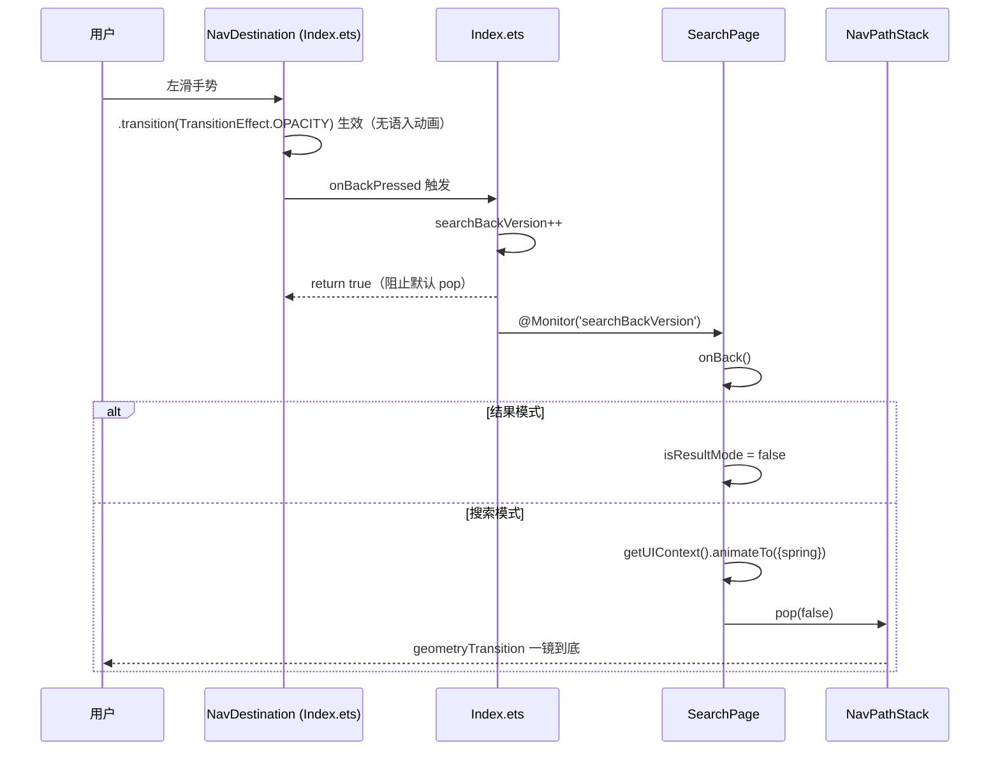

## 问题
从搜索页左滑返回首页时，Navigation 默认的页面滑入/滑出动画仍然播放，与 `geometryTransition('SEARCH_ONE_SHOT_TRANSITION_ID')` 一镜到底效果冲突，导致过渡被截断。

## 根因
对比官方 `transitions-collection-master` 参考项目，目前代码存在三个关键差异：

1. **NavDestination 缺少 `.transition(TransitionEffect.OPACITY)`**：官方代码在 SearchLongTakeTransitionPageTwo 的 NavDestination 上设置此属性，告诉 Navigation 系统页面切换时使用透明度过渡，而非默认的滑入/滑出动画。我们缺少这一行，系统默认用滑动动画，与 geometryTransition 冲突。

2. **`getUIContext().animateTo()` 调用上下文不对**：官方在 PageTwo 组件自身内部（其 `build()` 直接返回 `NavDestination()`）调用 `getUIContext()`，UIContext 与 NavDestination 在同一上下文中。我们的 `onBackPressed` 定义在 `Index.ets` 的 `navDestinationBuilder` 里，`getUIContext()` 获取的是外层 Index 组件的 UIContext。

3. **`@Consumer/@Provider` 方向错误**：`isSearchResultMode` 的 `@Provider` 在 SearchPage（后代组件），`@Consumer` 在 Index（祖先组件）。ArkUI V2 中 `@Consumer` 只能从祖先获取值，因此 Index 中的 `isSearchResultMode` 始终为 `false`。

## 修复目标
- 消除左滑手势引发的系统默认滑动动画
- 确保 geometryTransition 一镜到底效果流畅展示
- 保持结果模式（搜索结果页）的左滑退回到搜索模式、搜索模式的左滑返回首页的行为不变


## 技术方案

### 核心修改

**第1步：NavDestination 添加 `.transition(TransitionEffect.OPACITY)`**
这是主修复。参考官方 `SearchLongTakeTransitionPageTwo.ets` 第70行：
```typescript
NavDestination() { ... }
.transition(TransitionEffect.OPACITY)
```
该属性告诉 Navigation 系统此 NavDestination 使用透明度过渡替代默认滑动动画，从而消除与 geometryTransition 的视觉冲突。

**第2步：简化 `onBackPressed` 为纯信号模式**
Index.ets 的 `onBackPressed` 不再直接调用 `animateTo + pop(false)`，改为统一递增 `searchBackVersion` + `return true`。NavPathStack 的 pop 操作移回 SearchPage 内部执行，确保 `getUIContext()` 在 NavDestination 的组件树上下文中被调用。

**第3步：清理错误的 `@Consumer/@Provider` 通信**
删除 `@Provider isSearchResultMode`（SearchPage）和 `@Consumer isSearchResultMode`（Index），因为其方向错误且不再需要——结果模式的判断逻辑已在 SearchPage 的 `onBack()` 方法中处理。

### 修复后数据流



### 改动文件

| 文件 | 改动类型 | 说明 |
|------|---------|------|
| `entry/.../pages/Index.ets` | 修改 | 添加 `.transition(TransitionEffect.OPACITY)`；删除 `@Consumer isSearchResultMode`；简化 `onBackPressed` 为纯信号 |
| `features/search/.../view/SearchPage.ets` | 修改 | 删除 `@Provider isSearchResultMode`；删除 `@Monitor('isResultMode')`；`@Monitor('searchBackVersion')` 改为调用 `onBack()` |

