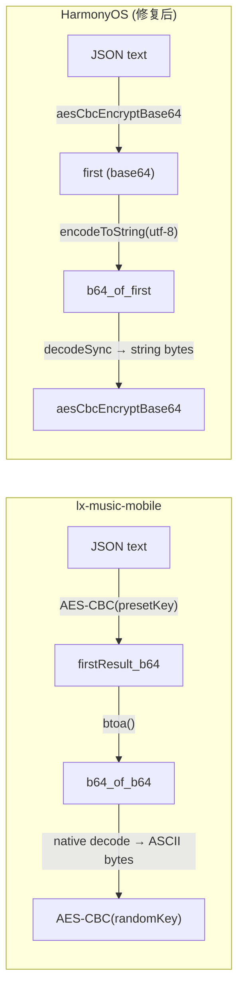

## 问题
HarmonyOS 上 weapi 请求 `v3/song/detail` 返回 `httpCode=200` 但 `resultLen=0`（空响应体），导致歌曲详情、封面补全等功能全部失败。

## 根因
对比 lx-music-mobile 的 `crypto.js` 实现，发现 **第二层 AES-CBC 加密的输入数据不同**：

- **lx-music-mobile**：`btoa(firstResult_b64)` — 对第一层结果做 double-base64 编码，native 模块 decode 后得到的是 base64 字符串的 ASCII 字节，加密的是**字符串字节**
- **HarmonyOS 当前**：直接传入 `first`（base64 字符串），`aesCbcEncryptBase64` 内部 `decodeSync` 后得到的是**二进制密文**，加密的是错误数据

服务端用 lx-music-mobile 的方式解密，拿到的是乱码，因此返回空响应。

## 修复目标
在 `MusicApiUtils.ets` 的 `weapiEncrypt` 函数中，第二层 AES 调用前对 `first` 做一次额外 base64 编码，对齐 lx-music-mobile 的 `btoa(first)` 行为，使加密输入变为字符串字节而非二进制密文。


## Tech Stack
- 语言：ArkTS (HarmonyOS)
- 加密框架：`@kit.CryptoArchitectureKit`（AES-128-CBC-PKCS7、RSA-1024-NoPadding）
- HTTP：`@kit.NetworkKit`（`http.createHttp().request`）
- 编码工具：`buffer`、`util.Base64Helper`（`@kit.ArkTS`）

## 实现方案

### 修复策略
在 `weapiEncrypt` 函数中，在第二层 AES-CBC 调用前，对第一层结果 `first`（base64 字符串）追加一次 base64 编码：

```
修改前：aesCbcEncryptBase64(first, rk, iv)        // decode first → 二进制密文 ✗
修改后：aesCbcEncryptBase64(b64_of_first, rk, iv) // decode b64 → 字符串字节 ✓
```

### 数据流对比



### 复杂度分析
- 修改范围：**仅 1 行**（`MusicApiUtils.ets` 第 143 行附近）
- 额外计算：一次 `base64(utf8(first))` 编码，O(n) 其中 n 为 first 字符串长度（约 100-200 字节），无性能影响
- 不影响其他函数：`aesCbcEncryptBase64`、`rsaEncryptNoPadding`、`eapiEncrypt` 等均无需改动

### 验证方式
- 编译通过，0 lint 错误
- 运行时 `WEAPI_RESP` 日志应显示 `resultLen > 0` 且 `httpCode=200`
- `getSongDetail` 能正常返回歌曲详情（含 `al.picUrl` 封面）

