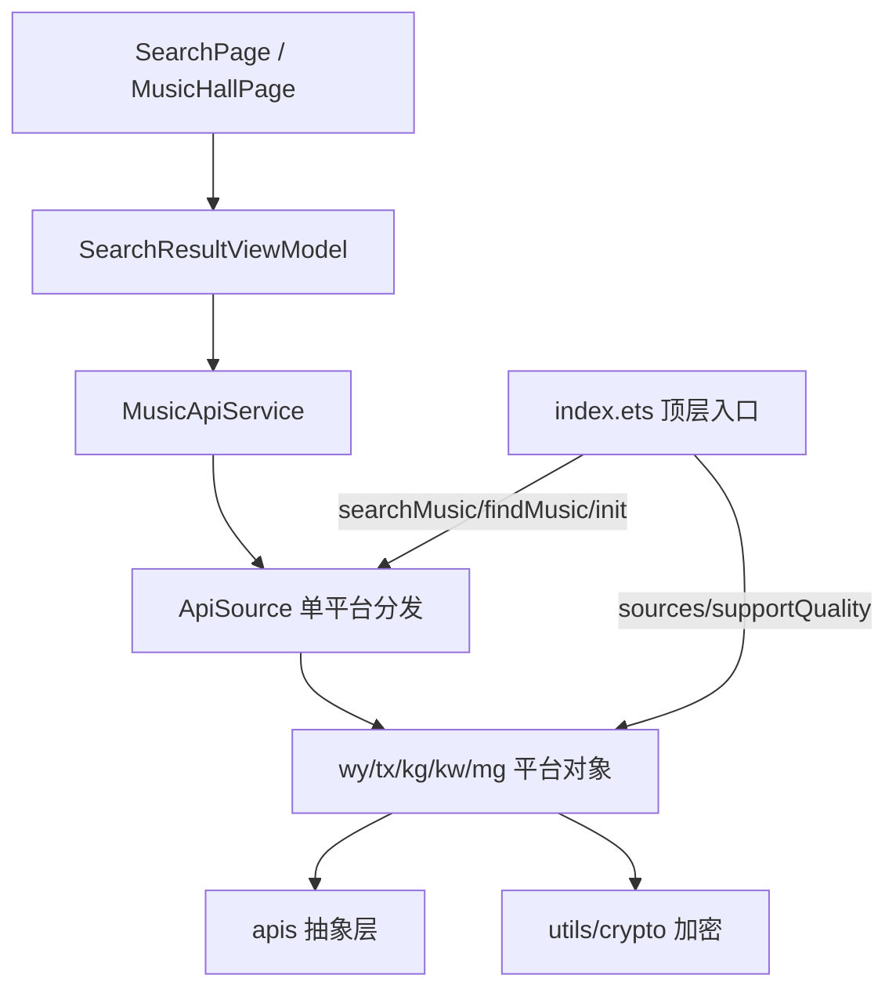

## 用户需求概述
将 `common/musicbasic/.../musicSdk` 进一步对齐 `lx-music-mobile` 的音源架构，使其成为项目唯一音源，并删除 `features/search/service/platform` 下的重复旧实现。

## 核心任务
- 修复现状：删除 `tx/kg/kw/mg` 文件顶部被注入的残缺 `SearchResultItem` 坏块，恢复编译。
- 统一类型模型：将 `SearchResultItem` 对齐 lx 的 `types/_types/typeUrl` 多音质候选结构，搜索返回从裸数组改为 `{ list, allPage, limit, total, source }` 包装对象；删除 `features/search/model/SearchResultItem.ets` 重复模型，UI 统一从 `musicbasic` 导入。
- 文件拆分：每个平台由单一 `index.ets` 拆分为 `musicSearch/songList/lyric/hotSearch/musicInfo/comment/leaderboard/tipSearch` 子模块，`index.ets` 组装为对象（对齐 lx，平台对象形态按用户指示不强制）。
- API 源抽象层：新建 `apis(source)` 工厂 + `supportQuality`，`getMusicUrl` 等委托 `apis('wy').getMusicUrl`。
- 补齐端点：新增 `leaderboard`(排行榜)、`comment`(评论)、`getPic`(封面)、`getMusicDetailPageUrl`、`tipSearch`(智能提示)、歌单内歌曲(`songList`)。
- 顶层入口：在 `index.ets` 增加 `searchMusic`(并行搜全平台)、`findMusic`(模糊匹配)、`init`，并导出 `sources`/`supportQuality`。
- 调用链同步：改造 `ApiSource` 改为调用平台对象方法并新增端点分发；同步 `MusicApiService`、`SearchResultViewModel`、`SearchPage`、`common/Index.ets` 适配包装返回。
- 清理：删除 `features/search/service/platform` 下 5 个重复实现，确认无残留引用并通过编译/lint。


## 技术栈
- HarmonyOS ArkTS/ETS（ArkUI V2：@ObservedV2/@Trace），`common/musicbasic` 作为公共 HAR。
- 参考实现：`C:\Users\PoXia\Documents\lx-mobile\lx-music-mobile\src\utils\musicSdk`。
- 加密工具已就绪：各平台 `utils/crypto.ets`（zzcSign / eapi / weapi / decodeBase64Lyric / formatDuration），保留复用。

## 实现方案
1. **统一类型模型（types.ets）**：新建 `musicSdk/types.ets`，导出带 `@ObservedV2/@Trace` 的 `SearchResultItem`（保留 title/singer/album/quality/duration/cover/coverUrl/source/songId/rawFields，新增 `types: {type:string,size:string}[]`、`_types: Record<string,{size:string}>`、`typeUrl: Record<string,string>`），并导出 `SearchResult` 包装接口 `{ list, allPage, limit, total, source }` 与 `SuggestionItem`/`SuggestionType`。`wy/index.ets` 改为从 `types.ets` 导入，删除其本地重复定义。删除 `features/search/model/SearchResultItem.ets`，UI 改为 `import { SearchResultItem } from 'musicbasic'`。
2. **文件拆分（对齐 lx）**：每个平台目录拆为独立函数模块 `musicSearch.ets`/`songList.ets`/`lyric.ets`/`hotSearch.ets`/`musicInfo.ets`/`comment.ets`/`leaderboard.ets`/`tipSearch.ets`，`index.ets` 组装为 `const wy = { musicSearch, songList, hotSearch, comment, leaderboard, getMusicUrl, getLyric, getPic, getMusicDetailPageUrl, tipSearch }`。ArkTS 不支持跨文件 partial class，故采用函数模块 + 对象组装（用户已确认平台对象形态不重要）。
3. **apis() 抽象层**：新建 `api-source.ets` 导出 `apis(source)` 工厂与 `supportQuality`；当前无镜像切换需求，`apis(source)` 直接返回对应平台对象（预留 `api-source-info.ets` 声明 `supportQualitys`）。`getMusicUrl` 等委托 `apis('wy').getMusicUrl`，与 lx 一致。
4. **补齐端点**：用 [subagent:code-explorer] 读取 lx 各平台 `leaderboard.js`/`comment.js`/`musicInfo.js`/`tipSearch.js`/`songList.js`，移植并适配 ArkTS（字段映射、HTTP 封装、异常兜底）。注意 `songList` 语义为"按歌单 id 取歌单内歌曲"，与现有 `getPlaylists`(推荐歌单列表) 不同，二者并存。
5. **顶层入口**：`index.ets` 增加 `searchMusic({name, singer, source, limit})`（并行调用各平台 `musicSearch` 返回每源列表数组）与 `findMusic(musicInfo)`（模糊匹配挑选最佳结果，对齐 lx 算法），并导出 `sources`/`supportQuality`/`init`。
6. **调用链同步**：`ApiSource` 改为调用平台对象方法（`wy.musicSearch(...)` 等），新增 `leaderboard/comment/getPic/tipSearch/getPlaylistSongs` 分发；`MusicApiService` 改 import 来源并透传 `searchMusic/findMusic`；`SearchResultViewModel.results` 改为持有 `SearchResult.list`，UI `SearchPage` 读取 `.list`；`common/musicbasic/Index.ets` 更新导出（移除 `WyMusicApi` 等 class 导出，保留对象与类型）。

## 实现注意
- **性能**：`searchMusic` 并行 `Promise.all` + `.catch(_=>null)` 隔离单平台失败；`findMusic` 复用 lx 的 `filterStr`/`getIntv` 模糊匹配，避免重复请求。`getPlayUrl` 保留 JSVM 优先、API 兜底的双路径（不受本次改造影响）。
- **日志**：复用 `Logger`（TAG 沿用现有），避免打印完整歌词/URL 大负载；错误 `JSON.stringify(e)` 已存在，保持。
- **爆破半径**：类型模型改造仅加法（新增字段）不破坏现有展示字段；删除重复模型与 platform 文件前须确认无其它 import（搜索显示仅 `MusicApiService` 走 `ApiSource`→musicSdk）。保持 `getPlaylists`/`getPlaylistTags` 返回 `MusichallPlaylistItem[]`/`TagFilterGroup[]` 不变，`MusicHallPage` 不受影响。

## 架构设计


## 目录结构
```
common/musicbasic/src/main/ets/util/musicSdk/
├── types.ets                 # [NEW] 统一 SearchResultItem(@ObservedV2/@Trace + types/_types/typeUrl)、SearchResult 包装、SuggestionItem/SuggestionType
├── api-source.ets            # [NEW] apis(source) 工厂 + supportQuality 导出
├── api-source-info.ets       # [NEW] 各平台 supportQualitys 声明
├── index.ets                 # [MODIFY] 导出对象/类型；新增 searchMusic/findMusic/init/supportQuality
├── ApiSource.ets             # [MODIFY] 改为调用平台对象方法，新增端点分发
├── utils.ets                 # [MODIFY] 保留 platformToId，按需补充
├── wy/  (tx/kg/kw/mg 同构)
│   ├── index.ets             # [MODIFY] 移除坏块/本地类型，组装 const 对象
│   ├── musicSearch.ets       # [NEW] 搜索 → 返回 SearchResult
│   ├── songList.ets          # [NEW] 歌单内歌曲
│   ├── lyric.ets             # [NEW] getLyric
│   ├── hotSearch.ets         # [NEW] 热搜
│   ├── musicInfo.ets         # [NEW] getMusicUrl/getPic/getMusicDetailPageUrl/歌曲详情
│   ├── comment.ets           # [NEW] 评论
│   ├── leaderboard.ets       # [NEW] 排行榜
│   ├── tipSearch.ets         # [NEW] 智能提示
│   └── utils/crypto.ets      # [KEEP] 加密工具，保留
features/search/src/main/ets/
├── model/SearchResultItem.ets        # [DELETE] 重复模型，改用 musicbasic 导出
├── viewmodel/SearchResultViewModel.ets  # [MODIFY] results 改持 SearchResult.list，适配 wrapper
├── view/SearchPage.ets               # [MODIFY] 读取 .list
├── service/MusicApiService.ets       # [MODIFY] 改 import 来源，透传 searchMusic/findMusic
├── service/platform/*.ets            # [DELETE] Kg/Kw/Mg/Tx/WyMusicApi 5 个重复实现
└── Index.ets                         # [MODIFY] 确认导出，移除 platform 重导出
common/musicbasic/Index.ets           # [MODIFY] 更新 musicSdk 导出（对象+类型，去 class 导出）
```

## 关键代码结构
```typescript
// types.ets
@ObservedV2
export class SearchResultItem {
  @Trace title: string = ''
  @Trace singer: string = ''
  @Trace album: string = ''
  @Trace quality: string = ''
  @Trace duration: string = ''
  @Trace cover: string = ''
  @Trace coverUrl: string = ''
  @Trace source: string = ''
  @Trace songId: string = ''
  public rawFields: Record<string, Object> = {}
  // 对齐 lx 多音质候选
  types: { type: string, size: string }[] = []
  _types: Record<string, { size: string }> = {}
  typeUrl: Record<string, string> = {}
}

export interface SearchResult {
  list: SearchResultItem[]
  allPage: number
  limit: number
  total: number
  source: string
}

// api-source.ets
export const apis = (source: string): MusicPlatform => { /* 返回对应平台对象，预留镜像切换 */ }
export const supportQuality: Record<string, Record<string, string>> = {}
```


## Agent Extensions
### SubAgent
- **code-explorer**
  - Purpose: 读取 lx-music-mobile 各平台 `leaderboard.js`/`comment.js`/`musicInfo.js`/`tipSearch.js`/`songList.js` 参考实现，提取端点逻辑、请求参数与字段映射
  - Expected outcome: 获得可移植到 ArkTS 的端点实现要点，确保补齐的端点与 lx 结构对齐
