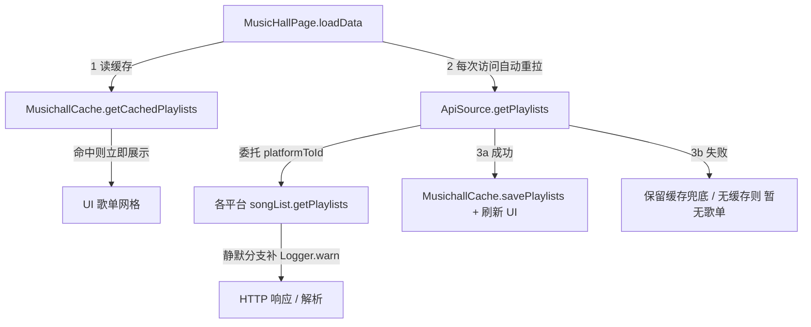

## 用户需求
MusicHall（音乐厅）页面在所有平台均显示"暂无歌单"空状态。用户要求：先加诊断日志定位"为何空"的根因，同时为在线歌单建立持久化层，使数据重启后仍在，且每次访问页面自动重新请求（缓存作为兜底/离线展示）。

## 产品概述
在 MusicHall 歌单加载链路上补齐诊断日志，并新增在线歌单持久化缓存。页面改为"先展示本地缓存、再自动重新请求、成功则刷新并落盘、失败则保留缓存兜底"的数据流，解决空状态无据可查、且每次进入都重新拉取的问题。

## 核心功能
- 在页面层、API 调度层、各平台 SDK 层的静默 `return []` 分支补齐结构化诊断日志（统一 `[musichome]` 前缀），覆盖 HTTP 非 200、body.code 异常、data 空、list 空，输出响应码、截断原始响应与请求 URL。
- 新增 `MusichallCache` 持久化层（Preferences），按 `平台+标签+排序` 维度缓存歌单列表与标签分组，重启后仍在。
- 改写 `MusicHallPage.loadData`：进入即读取缓存并展示，同时自动重新请求；成功则更新 UI 并落盘，失败则保留缓存（无缓存才显示"暂无歌单"）。
- 明确不做：不打通 MusicHall 收藏与"我的"收藏；不抽统一请求层；不持久化歌单内歌曲。


## 技术栈
- HarmonyOS ArkTS（严格模式），DevEco Studio / hvigor 构建
- 持久化：`@kit.ArkData` 的 `preferences`（对齐同模块 `AudioSourceDb.ets` 范本）
- 日志：项目内 `Logger`（封装 hilog，domain 0x0000，前缀 `[musichome]`，多参数以 " | " 拼接）

## 实现方案
### 策略
1. **持久化层对齐范本**：新建 `MusichallCache`，完全参照 `AudioSourceDb` 的单例 + `init(context)` + 显式 `serialize/deserialize` + 内存 `cache` + `put/flush` 模式，降低认知与维护成本。
2. **缓存优先 + 自动重拉**：`loadData` 先同步读缓存展示（首屏不白屏），再异步重拉；成功落盘、失败兜底。满足用户"每次访问自动重新请求 + 持久化"的双重要求。
3. **诊断日志仅追加**：所有 `return []` 分支改为 `Logger.warn(...); return []`，零业务逻辑改动，便于用 `[musichome]` 过滤定位"为何空"。

### 关键技术决策
- **为何用 Preferences 而非 RDB**：歌单是扁平的 `MusichallPlaylistItem[]`，按 key 存 JSON 串最契合，且 `AudioSourceDb` 已验证此路径；RDB 的关系能力在此用不上，过度设计。
- **序列化只取字符串形态**：`MusichallPlaylistItem.coverImage` 为 `Resource|string`，持久化时仅存 API 返回的 URL 串与 `title` 串；`PlaylistCard` 已用 `typeof === 'string'` 分支渲染网络图，反序列化后可直接显示。
- **键方案**：`musichall_playlists_${source}_${tag}_${sort}` 与 `musichall_tags_${source}`，精确区分平台/筛选/排序组合。
- **Context 初始化**：`preferences.getPreferences` 需要 `Context`；在 `EntryAbility.ets` 调用 `AudioSourceManager.init(this.context)` 的同处追加 `MusichallCache.getInstance().init(this.context)`，并在 `common/musicbasic/Index.ets` 导出该缓存类供 `musichall` 模块引用。

### 性能与可靠性
- 日志仅在 HTTP 响应回调后触发（单次请求 1~4 条），开销可忽略；raw 截断 `slice(0,200)` 防止 hilog 刷屏。
- 缓存读写为异步 `preferences` 调用，主线程无阻塞；内存 `cache` 避免重复解析 JSON。
- 失败兜底保证离线/弱网时仍有内容，不会因一次网络抖动直接"暂无歌单"。

### 实现注意
- **明确文本拦截嫌疑**：酷我 `kw/songList.ets` 使用明文 `http://`，HarmonyOS 默认可能拦截明文流量，是"全部空"的高度可疑根因；日志的 `responseCode`/异常将直接证伪或证实，先不改动请求。
- **确保自动重拉**：确认切到 MusicHall tab 时 `loadData` 会重新触发（当前 `aboutToAppear` 在页面创建时执行；若 tab 复用页面实例需补 `onPageShow`/tab 切换监听），否则"每次访问自动重请求"不生效。
- **编辑纪律**：改动前先 `read_file` 取精确内容再 `replace`；不删除任何已有日志，仅追加；各 `songList` 已 import `Logger`，无需新增导入。

## 架构设计


## 目录结构
```
common/musicbasic/src/main/ets/
├── db/
│   └── MusichallCache.ets              # [NEW] 在线歌单持久化层。单例，init(context) 初始化 preferences；
│                                      #       提供 getCachedPlaylists/savePlaylists、getCachedTags/saveTags，
│                                      #       键按 source+tag+sort 维度；显式 serialize/deserialize MusichallPlaylistItem
│                                      #       （仅字符串字段），带内存 cache，对齐 AudioSourceDb 范本。
├── Index.ets                          # [MODIFY] 在导出 AudioSourceDb 附近追加 export { MusichallCache }，
│                                      #       供 features/musichall 通过 'musicbasic' 引用。
├── util/
│   ├── musicSdk/
│   │   ├── ApiSource.ets              # [MODIFY] getPlaylists/getPlaylistTags 增加入参、platformToId 映射结果、
│   │   │                              #       返回条数日志（Logger.info/warn）。
│   │   ├── kw/songList.ets            # [MODIFY] getPlaylists 4 个静默 return [] 补 Logger.warn
│   │   │                              #       （responseCode/body.code/data/list/截断 raw/URL）。
│   │   ├── tx/songList.ets            # [MODIFY] getPlaylists 静默分支补 URL 与 raw 日志。
│   │   ├── kg/songList.ets            # [MODIFY] getPlaylists 静默分支补 URL 与 raw 日志。
│   │   ├── mg/songList.ets            # [MODIFY] getPlaylists 静默分支补 URL 与 raw 日志。
│   │   └── wy/songList.ets            # [MODIFY] getPlaylists 已有 warn/info，仅补请求 URL 日志。
│   └── Logger.ets                     # [引用] 复用，不改。
└── data/
    └── MusichallPlaylistItem.ets      # [引用] 模型不变，序列化时只取字符串字段。

entry/src/main/ets/entryability/
└── EntryAbility.ets                   # [MODIFY] 在 AudioSourceManager.init(this.context) 同处调用
                                       #       MusichallCache.getInstance().init(this.context)。

features/musichall/src/main/ets/view/
└── MusicHallPage.ets                  # [MODIFY] loadData 改写为：先读缓存展示 → 自动重拉 → 成功落盘刷新 /
                                       #       失败兜底；入口/出口补诊断日志；确保每次访问触发重拉。
```

## 关键代码结构
```typescript
// MusichallCache.ets（核心接口骨架，仅方法签名）
export class MusichallCache {
  static getInstance(): MusichallCache
  init(context: Context): Promise<void>
  getCachedPlaylists(source: string, tag: string, sort: string): Promise<MusichallPlaylistItem[]>
  savePlaylists(source: string, tag: string, sort: string, items: MusichallPlaylistItem[]): Promise<void>
  getCachedTags(source: string): Promise<TagFilterGroup[]>
  saveTags(source: string, groups: TagFilterGroup[]): Promise<void>
  // 私有：serialize / deserialize / 内存 cache
}
```

