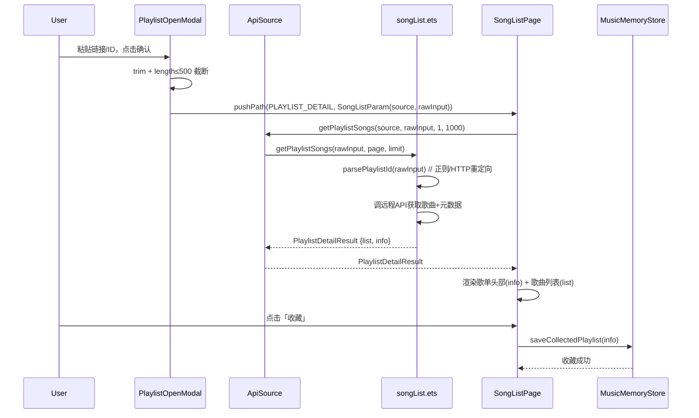

## 产品概述
为 lucid_music 音乐播放器添加「打开歌单」功能，支持通过分享链接或歌单 ID 导入远程歌单进行查看、播放和收藏。同时重构「我的」页面，将自建歌单和收藏歌单合并为统一的「我的歌单」。

## 核心功能
- **打开歌单按钮**：音乐厅页面右上角新增入口按钮，点击弹出输入弹窗
- **链接/ID 解析**：支持粘贴各大平台（网易云/QQ音乐/酷狗/酷我/咪咕）的分享链接或纯歌单 ID，自动解析为平台+ID 组合
- **歌单查看与播放**：解析后跳转歌单详情页，展示歌单封面、名称、作者、播放量等元信息，歌曲列表支持点击播放
- **歌单收藏**：远程歌单详情页提供收藏按钮，收藏后保存到「我的歌单」
- **我的歌单统一**：合并自建歌单和收藏歌单为单一列表，每项标注类型（自建/收藏），点击自建加载本地歌曲，点击收藏远程拉取


## 技术栈
- 语言：ArkTS（HarmonyOS ArkUI V2 严格模式）
- 架构：HAR 模块化（common/musicbasic + features/*）
- 状态管理：@ComponentV2 / @ObservedV2 / @Trace / @Local / @Computed
- 导航：NavPathStack.pushPath
- 网络：@kit.NetworkKit http.createHttp()
- 参考：lx-music-mobile 歌单链接解析逻辑

## 实现方案

### 整体策略
对齐 lx-music-mobile 的「打开歌单」设计：各平台 SDK 内部的 `getPlaylistSongs` 方法扩展为接受原始输入（URL 或 ID），内部做 ID 解析后再调远程 API，同时返回歌单元数据（名称、封面、作者等）。

### 关键架构决策

**1. 数据类型分层**
- 新增 `PlaylistDetailResult` 类型（继承 SearchResult 语义，增加 `info: PlaylistMeta`），避免修改广泛使用的 `SearchResult`
- 扩展 `PlaylistRow` 增加远程歌单字段（source, sourceListId, coverUrl, author），复用现有 playlistType=1 表示收藏

**2. URL 解析下沉到各平台 SDK**
- 每个平台的 `songList.ets` 新增内部 `parsePlaylistId(rawInput: string)` 方法
- `getPlaylistSongs` 改造：入参接受原始 URL/ID → 调用 parsePlaylistId → 调远程 API → 返回 PlaylistDetailResult（含 info）
- 解析策略对齐 lx-music-mobile：正则优先 → HTTP 重定向跟随（网易云/QQ音乐）；纯数字走酷狗码（酷狗）

**3. 接口返回扩展**
- 各平台 `getPlaylistSongs` 从返回 `SearchResult` 改为返回 `PlaylistDetailResult`（新增 playlist info）
- `MusicPlatform` 签名同步更新
- `ApiSource.getPlaylistSongs` 返回值同步更新
- 对已有调用方（SongListPage 远程模式）零破坏——只需从结果中同时读取 list 和 info

**4. 歌单保存设计**
- 收藏远程歌单时创建 PlaylistRow（playlistType=1, songIds=[] 留空, 填充远程字段）
- 从「我的歌单」打开收藏项时，SongListParam 携带 source + sourceListId，走现有远程模式加载
- 取消收藏：从 store.playlists 和 store.collectedPlaylistIds 移除

### 数据流设计



## 实现细节

### 目录结构

```
common/musicbasic/src/main/ets/
├── data/
│   ├── PlaylistDetailResult.ets    # [NEW] 歌单详情结果类型
│   └── PlaylistRow.ets             # [MODIFY] 扩展远程歌单字段
├── components/
│   └── PlaylistOpenModal.ets       # [NEW] 打开歌单输入弹窗
│   └── SongListPage.ets            # [MODIFY] 歌单头部信息 + 收藏按钮
├── util/musicSdk/
│   ├── types.ets                   # [MODIFY] MusicPlatform 签名更新
│   ├── ApiSource.ets               # [MODIFY] getPlaylistSongs 返回类型变更
│   ├── index.ets                   # [MODIFY] 导出 PlaylistDetailResult
│   ├── wy/songList.ets             # [MODIFY] +parsePlaylistId +返回PlaylistDetailResult
│   ├── tx/songList.ets             # [MODIFY] 同上
│   ├── kg/songList.ets             # [MODIFY] 同上
│   ├── kw/songList.ets             # [MODIFY] 同上
│   ├── mg/songList.ets             # [MODIFY] 同上
│   ├── wy/index.ets                # [MODIFY] 导出不变（方法签名由MusicPlatform约束）
│   ├── tx/index.ets                # [MODIFY] 同上
│   ├── kg/index.ets                # [MODIFY] 同上
│   ├── kw/index.ets                # [MODIFY] 同上
│   └── mg/index.ets                # [MODIFY] 同上
├── db/
│   └── MusicMemoryStore.ets        # [MODIFY] 收藏/取消收藏远程歌单
├── util/
│   └── MusicDbApi.ets              # [MODIFY] 公开收藏远程歌单 API
└── Index.ets                       # [MODIFY] 导出新类型和组件

features/musichall/src/main/ets/view/
├── MusicHallPage.ets               # [MODIFY] 集成打开歌单按钮
└── SourceTabBar.ets                # [MODIFY] suffix 增加「打开」图标

features/mine/src/main/ets/view/
└── PlaylistSection.ets             # [MODIFY] 合并为「我的歌单」
```

### 关键代码结构

**1. PlaylistDetailResult 类型**
```typescript
// common/musicbasic/src/main/ets/data/PlaylistDetailResult.ets
export class PlaylistMeta {
  name: string = ''
  img: string = ''
  desc: string = ''
  author: string = ''
  playCount: string = ''
}

export interface PlaylistDetailResult {
  list: SearchResultItem[]
  allPage: number
  limit: number
  total: number
  source: string
  info: PlaylistMeta
}
```

**2. PlaylistRow 扩展**
```typescript
// 新增字段（playlistType === 1 时有效）
public source: string = ''        // 平台标识: kg/tx/wy/kw/mg
public sourceListId: string = ''  // 远程歌单原始ID
public coverUrl: string = ''      // 封面URL（用于「我的歌单」展示）
public author: string = ''        // 作者/创建者
```

**3. parsePlaylistId 通用模式（各平台 songList.ets）**
```typescript
function parsePlaylistId(rawInput: string): string {
  const id = rawInput.trim()
  // 1. 如果是纯数字，直接返回
  if (/^\d+$/.test(id)) return id
  // 2. 正则匹配已知链接格式
  if (regExps.listDetailLink.test(id)) return id.replace(regExps.listDetailLink, '$1')
  // 3. HTTP 请求跟随重定向提取（异步）
  return httpGetAndExtractId(id)
}
```

**4. PlaylistOpenModal 组件接口**
```typescript
// 输入：activeSource（当前平台）
// 事件：onConfirm(id: string) — 原始输入直接传递
// 内部：TextInput + 提示文案
```

### 性能考量
- URL 解析中 HTTP 重定向是慢路径（仅正则不匹配时触发），主路径为纯数字或正则匹配，O(1)
- 各平台 `getPlaylistSongs` 保持现有缓存策略不变
- 收藏歌单列表从 store.playlists 内存读取，O(n) 过滤，n 为用户歌单总数（通常 < 100）

### 向后兼容
- `SongListPage` 现有远程模式（`source !== ''`）行为不变，只是 `getPlaylistSongs` 返回值增加 info 字段
- `PlaylistSection` 现有自建歌单逻辑完全保留，收藏逻辑改为远程拉取
- 已有 `MusicPlatform` class 兼容对象字面量构造（ArkTS 特性）

