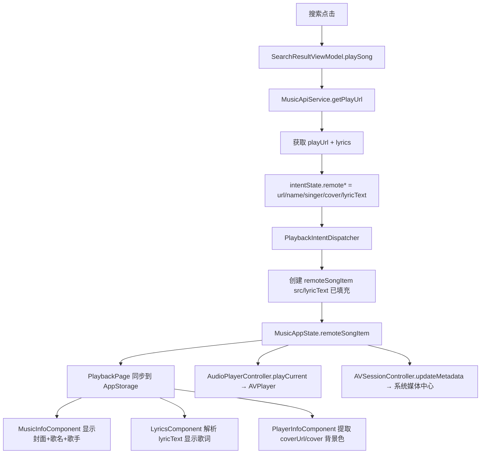

## 用户需求

1. **音源自动初始化**：添加首个音源后自动初始化；每次启动应用也自动初始化已启用的音源
2. **背景闪烁修复**：从控制栏点击进入播放详情页时，背景不应从黑色闪烁到封面颜色
3. **播放详情页信息更新**：播放信息（歌名、歌手、封面、歌词）统一写入 common/MusicAppState，MusicInfoComponent/LyricsComponent/AVSessionController 全部从 state 读取，不依赖 AppStorage 静态 songList
4. **酷狗/QQ 可播放**：调试 MusicApiService.getPlayUrl，确保两平台返回真实可播放 URL
5. **歌词支持**：远程歌曲播放时显示歌词，并同步到系统媒体中心

## 核心功能

- 启动时自动激活已启用音源（若无则激活首个）
- 播放详情页所有信息组件实时反映 MusicAppState 当前歌曲
- 背景色平滑过渡（利用 MusicAppState 缓存的 imageColor）
- 酷狗/QQ 播放 URL 获取 API 修复与调试
- 远程歌曲歌词获取、解析、显示全链路


## 技术方案

### 1. 播放详情页数据源改造（核心改动的设计思路）

**现状问题**：MusicInfoComponent、LyricsComponent、PlayerInfoComponent 全部从 `@StorageLink('songList')` + `@StorageProp('selectIndex')` 读取 `this.songList[this.selectIndex]`。这个 songList 是 PlaybackPage 在 aboutToAppear 时写入的硬编码 `defaultSongList`，远程歌曲信息无法反映。

**改造策略（最小侵入）**：不改组件的 StorageLink 声明，而是在 PlaybackPage 中将 MusicAppState 当前歌曲信息**实时同步**到 AppStorage 中，让现有组件自然拿到正确数据。

```
MusicAppState.remoteSongItem 变化
  → PlaybackPage @Monitor 检测
    → AppStorage.setOrCreate('currentSongTitle', title)
    → AppStorage.setOrCreate('currentSongSinger', singer)
    → AppStorage.setOrCreate('currentSongCover', coverUrl | label)
    → AppStorage.setOrCreate('currentSongLyric', lyricText | lyric)
    → AppStorage.setOrCreate('currentSongCoverUrl', coverUrl)
    → MusicInfoComponent / LyricsComponent / PlayerInfoComponent 读取
```

同时，MusicInfoComponent 中添加对 `coverUrl`（远程封面 URL）的 Image 支持，LyricsComponent 中添加对 `lyricText`（LRC 纯文本）的直接解析路径。

### 2. Kugou/QQ getPlayUrl 修复

**酷狗修复**：
- 当前 API `wwwapi.kugou.com/yy/index.php?r=play/getdata` 可能因跨域/反爬限制返回空
- 添加备用 API：`https://m.kugou.com/app/i/getSongInfo.php?cmd=playInfo&hash=HASH&key=...`
- 添加调试日志打印完整响应
- 若两个 API 都失败，记录详细错误信息到 playbackStatusMessage

**QQ 修复**：
- guid 从固定 `'0'` 改为动态生成随机数
- 检查 `midurlinfo[0].purl` 是否为空字符串（有 vkey 但无 purl 表示版权受限）
- 添加调试日志

### 3. 背景闪烁修复

**根因**：PlaybackPage 入场时 `imageColor` 被写为黑色(`rgba(0,0,2,1.00)`)，然后 `PlayerInfoComponent.getImageColor()` 异步提取封面主色后才更新。

**修复**：
- 在 `AudioPlayerController.initSessionMetadata()` 中，根据当前歌曲封面预先提取 color，写回 `MusicAppState.imageColor`
- `PlaybackPage.syncToAppStorage()` 不再覆盖 `imageColor`，改为从 `MusicAppState.imageColor` 读取已有值
- 只有当 MusicAppState.imageColor 仍为默认黑色时才允许 `PlayerInfoComponent.getImageColor()` 异步覆盖

### 4. 音源自动初始化

**Index.ets aboutToAppear()**：
- 添加逻辑：调用 `AudioSourceManager.getInstance().getActiveScript()` 检测是否有已启用音源
- 若无，调用 `AudioSourceManager.getInstance().getAll()` 获取所有音源，若列表非空则自动 `toggleEnabled(firstSource.id, true)`

### 5. 歌词支持

**获取歌词**：
- 酷狗：`play/getdata` API 响应中 `data.lyrics` 字段包含歌词文本
- QQ：需要额外 API 调用 `https://c.y.qq.com/lyric/fcgi-bin/fcg_query_lyric_new.fcg?songmid=SONGMID` 获取歌词

**歌词解析**：
- `LyricsComponent.getLrcEntryList()` 新增路径：检测 `currentSongLyric`（AppStorage 中存储的 lyricText），若非空且不以 `/` 开头（不是文件路径），直接 `parseLrcLyric(text)` 解析

**系统媒体中心**：
- `AVSessionController.updateMetadata()` 新增处理：若传入 `lyricText` 非空，直接作为歌词设置；否则尝试从 rawfile 读取

### 数据流图



