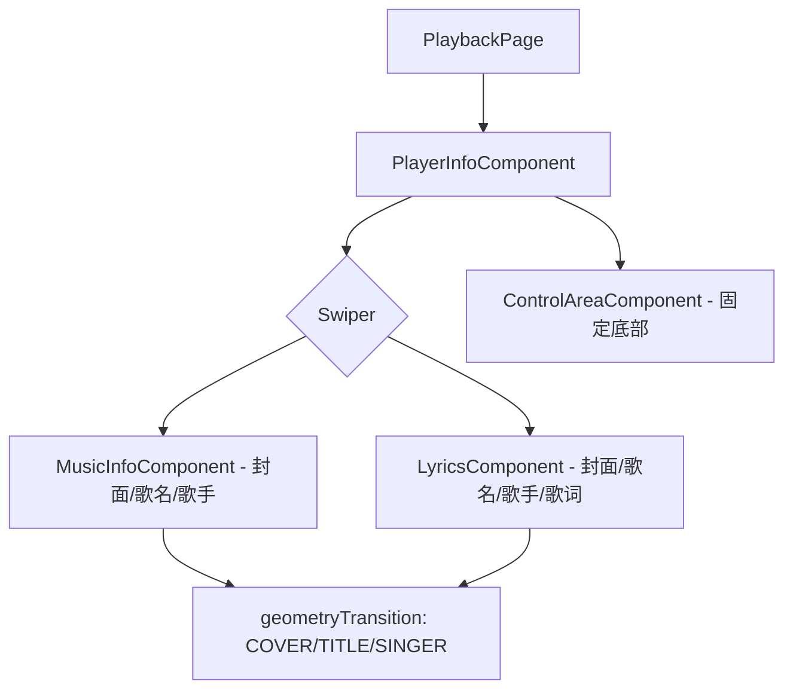

## 产品概述
对播放页进行三项重构优化：精简布局结构、修复状态栏遮挡、添加页面切换动效。

## 核心功能
1. **控制区域固化**：在 SM 模式下，将 ControlAreaComponent（进度条+播放按钮+工具栏）从 Swiper 内部提取到外部，使其在封面页和歌词页切换时固定在下方不动，不再跟随滑动。
2. **状态栏适配**：修复播放页顶部内容被状态栏遮挡的问题，通过 WindowUtil 获取真实状态栏高度并设置为顶部安全区 padding。
3. **一镜到底切换动画**：封面页与歌词页切换时，利用 geometryTransition 为封面图、歌名、歌手名三个公共元素添加共享过渡动画，实现元素流畅位移的视觉效果。


## 技术栈
- 框架：HarmonyOS ArkUI（@Component 声明式 UI）
- 语言：ArkTS / TypeScript
- 动画：geometryTransition（ArkUI 共享元素过渡）
- 状态管理：AppStorage + @StorageLink/@StorageProp
- 工具：getStatusBarTopVpFromWindowUtil（musicbasic 模块）

## 实现方案

### 整体策略
在 `PlayerInfoComponent.ets` 的 SM 模式分支中，将原本的 Swiper-only 布局改为 Column(Swiper + ControlAreaComponent) 布局。Swiper 占据上方弹性空间（layoutWeight:1），ControlAreaComponent 固定在底部。同时移除 `MusicInfoComponent.ets` 和 `LyricsComponent.ets` 中内嵌的 ControlAreaComponent。

### 关键改动点

#### 1. PlayerInfoComponent.ets — SM 模式布局重构
将 `Stack({ alignContent: Alignment.TopStart })` 内只放 Swiper 改为：

```
Column() {
  Swiper() {
    MusicInfoComponent()       // 不再包含 ControlAreaComponent
    LyricsComponent()          // 不再包含 ControlAreaComponent
  }
  .layoutWeight(1)             // 占据剩余空间

  ControlAreaComponent()       // 固定在下方
    .opacity(isShowControl ? 1 : 0)
    .animation({ duration: 300, curve: Curve.EaseInOut })
}
.width('100%').height('100%')
.padding({ top: this.topHeight })
```

ControlAreaComponent 的显隐从之前分散在 LyricComponent 内部改为通过 opacity 动画统一控制。isShowControl 初始值改为 true（封面页默认显示控制区）。

#### 2. MusicInfoComponent.ets — 移除内嵌 ControlAreaComponent
删除 Column 末尾的 `ControlAreaComponent()`（第63行），删除 `Blank()`（不再需要撑开空间），Column 高度不再用 `FULL_HEIGHT` 而是自然包裹内容。CoverInfo 和 MusicInfo 之间不再需要弹性空间分隔。

#### 3. LyricsComponent.ets — 移除条件渲染的控制区
删除 `@Link isShowControl` 和 `@Link isTablet` 声明（这两个参数不再需要），删除底部 conditionally rendered 的 `ControlAreaComponent()`（第211-217行），删除 onClick 中的 pageShowTime 重置（第219-221行）。Swiper onChange 中清除 intervalID 的逻辑移到 PlayerInfoComponent。

#### 4. PlaybackPage.ets — 修复 topHeight
在 `syncToAppStorage()` 中：
```
import { getStatusBarTopVpFromWindowUtil } from 'musicbasic';
// 替换 AppStorage.setOrCreate('topHeight', 0)
AppStorage.setOrCreate('topHeight', getStatusBarTopVpFromWindowUtil());
```
`music_component_top = 72vp` 在 SM 模式下已经提供了一定的顶部间距，加上状态栏高度后正好覆盖状态栏区域。

#### 5. geometryTransition 一镜到底动画
在 Swiper 的两个子页面中，为公共元素设置相同的 geometryTransition ID：
- 封面图：`id: 'PLAYBACK_COVER_TRANSITION'`
- 歌名：`id: 'PLAYBACK_TITLE_TRANSITION'`
- 歌手：`id: 'PLAYBACK_SINGER_TRANSITION'`

两个页面中每个元素的 geometryTransition 需要在 Swiper onChange 时机配合 `{ follow: true/false }` 属性来确保正确跟踪。由于 Swiper 切换时两个页面同时存在但是不同 index，geometryTransition 会自动处理位移插值。

**注意**：Swiper 的 `.onChange` 事件中两个页面的 geometryTransition follow 状态需要交换：当前选中页设为 `{ follow: false }`（目标位置），即将离开的页设为 `{ follow: true }`（跟随动画）。

### 架构说明



### 性能与注意事项
- Swiper cachedCount 保持默认1，不影响性能
- geometryTransition 多个 ID 互不干扰，性能开销在渲染管线内可接受
- opacity 动画替代条件渲染避免组件重建开销
- isShowControl 定时器改为在 PlayerInfoComponent 中统一管理而非分散在 LyricsComponent

