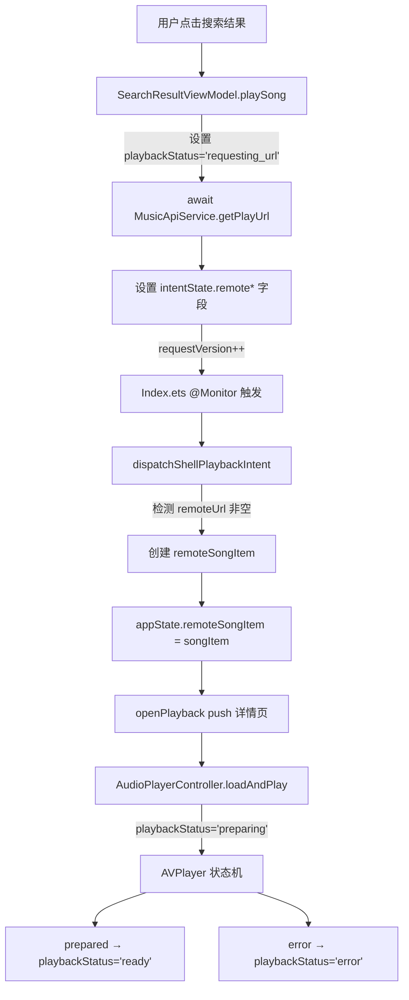

## 用户需求

1. **音源导入后无初始化状态**：导入音源后选中时，应显示初始化状态（初始化中/成功/失败）
2. **搜索点击后播放信息不更新**：点击搜索结果后直接跳出播放详情页，但信息一直是"Dream It Possible"，没有更新为所选歌曲
3. **列表点击反馈**：搜索结果列表点击时应有视觉高亮反馈
4. **MiniPlayerBar UI 改造**：上方显示"歌名-歌手"，下方显示歌词（超长滚动），播放请求时下方显示状态信息
5. **播放详情页进度条下方居中状态**：播放状态文字放在进度条下方、居中、与当前时间/总时间行平齐，仅在需要时显示（请求URL中/加载中/失败等）

## 技术方案

### 整体策略

核心思路是打通"搜索结果→可播放音频"的完整数据链路。在 `MusicApiService` 中新增 `getPlayUrl()` 方法获取各平台播放 URL，利用已有的 `PlaybackIntentState.remote*` 字段将播放 URL 和歌曲信息传递给播放器，在 `dispatchShellPlaybackIntent` 中创建 `remoteSongItem` 完成数据闭环。

### 数据流

### 关键设计决策

1. **播放 URL 获取放在 SearchResultViewModel**：异步执行，不影响 UI 响应
2. **复用已有 remote* 字段**：`PlaybackIntentState` 已有 `remoteUrl`/`remoteSongName`/`remoteSongSinger`/`remoteSongCover`，无需新增字段
3. **状态追踪在 MusicAppState**：通过 AppStorageV2 全局共享，各 UI 组件通过 `@Local` 订阅
4. **歌词滚动使用 TextOverflow.MARQUEE**：ArkUI 原生支持，无需额外动画

### 实现要点

- **MusicApiService.getPlayUrl()**：为五大平台实现播放 URL 获取（Kugou hash 查 URL、QQ songmid 查 URL、网易云 songid 查 URL、酷我 musicrid 查 URL、咪咕 copyrightId 查 URL）
- **dispatchShellPlaybackIntent()**：检测 `remoteUrl` 非空时构造 `SongItem` 赋值给 `appState.remoteSongItem`，然后 `resetRemote()`
- **AudioPlayerController**：在 `loadAndPlay`/`stateChangeCallback`/`errorCallback` 中更新 `playbackStatus` 和 `playbackStatusMessage`
- **MiniPlayerBar**：重构为 Column 内两个 Row，上行单行省略号显示"歌名 - 歌手"，下行根据状态切换歌词 MARQUEE 或状态文本
- **ControlAreaComponent**：在进度条 Slider 和时间 Row 之间插入居中的状态 Text，仅在 `playbackStatus` 非 idle/ready 时显示

