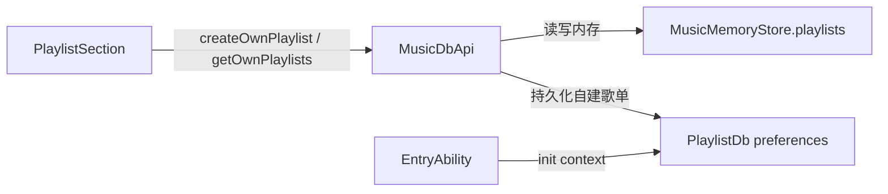

## 用户需求
- 歌单当前仅存于内存单例 `MusicMemoryStore.playlists`，每次启动 `seedTables()` 重新播种 5 个示例歌单，没有任何本地持久化。
- 用户要求：新增**本地持久化**（App 重启后自建歌单保留），并**删除现有示例（假）歌单**。
- 在"自建歌单 | 收藏歌单"切换栏最右侧新增"新建歌单"按钮，点击弹出弹窗输入歌单名称，确认后作为自建歌单（playlistType=0）加入列表并持久化。

## 产品概述
"我的"页面歌单区域支持自建/收藏切换，现需支持用户自建歌单并本地持久化，移除演示数据，提供新建入口与输入弹窗。

## 核心功能
- 移除启动时的示例歌单（自建 3 + 收藏 2），初始列表为空。
- 切换栏最右侧"+"按钮，点击弹出输入歌单名称的弹窗。
- 输入名称确认后创建自建歌单并持久化，刷新列表（必要时切到自建 Tab）。
- 自建歌单通过 Preferences 持久化，App 重启后保留；收藏歌单保持内存态（本次不改）。


## 技术栈
- HarmonyOS ArkUI（ArkTS 严格模式）：@ComponentV2 / @Local / @Builder / CustomDialog
- 持久化：preferences（@kit.ArkData），JSON 序列化 + 内存缓存，复用 `AudioSourceDb` 范式
- 数据层：MusicMemoryStore 单例 + MusicDbApi 封装

## 实现方案
### 问题根因与现状
- 歌单仅存内存，`MusicMemoryStore` 构造时 `seedTables()` 播种示例，无持久化。
- `PlaylistRow.title` 为 `Resource` 类型（种子用 `$r(...)`），用户自建标题为字符串且需 JSON 序列化，必须改为 `string | Resource`。

### 实现策略
1. 新增 `PlaylistDb`（参照 `AudioSourceDb`）：preferences 存储自建歌单 JSON；`init(context)` 异步初始化；`getAllOwn()` 优先缓存；`saveAllOwn(rows)` 序列化刷盘。序列化字段 `playlistId(number)` / `title(string)` / `songIds(number[])` / `playlistType(number)`。
2. `MusicMemoryStore` 移除 `buildPlaylists` 种子播种，`playlists` 初始为空；保留 `collectedPlaylistIds` 内存结构。
3. `MusicDbApi` 新增：
   - `initPlaylists()`：从 `PlaylistDb` 读出自建歌单，合并进 `store.playlists`（保留内存中的收藏 type=1）。
   - `createOwnPlaylist(title)`：生成 `id = 现有最大 playlistId + 1`（种子删除后初始为 0，首个新 id=1），构造 `PlaylistRow(playlistType=0, songIds=[])`，push 进 store，调用 `persistOwn()` 持久化，返回新行。
   - `persistOwn()`：取 type=0 的行，调 `PlaylistDb.saveAllOwn` 持久化。
   - `deleteOwnPlaylist` 删除后调用 `persistOwn()` 同步持久化。
4. `EntryAbility` 在 `AudioSourceManager.init` 之后调 `PlaylistDb.getInstance().init(this.context)`；`musicbasic/Index.ets` 导出 `PlaylistDb`。
5. `PlaylistSection`：切换 Row 最右侧新增"+"按钮（`SymbolGlyph plus`），点击弹出 `CreatePlaylistDialog`（CustomDialog，含 TextInput + 确认/取消），确认时调用 `MusicDbApi.createOwnPlaylist(name)`、切到自建 Tab 并 `loadPlaylists()` 刷新。

### 关键决策
- 仅持久化自建歌单（type=0）；收藏歌单为运行时收藏，保持内存态，与现状一致，超出本次范围。
- id 用 `max+1` 生成，跨重启稳定不冲突（持久化 id 固定）。
- 加载顺序：`EntryAbility` 调 init 后，UI 渲染（`aboutToAppear`→`getOwnPlaylists`）发生在 `loadContent` 之后，持久层已就绪。
- 删除种子不影响其它代码：已核查 `playlistId` 1-5 仅出现在 `MusicMemoryStore` 种子内部，`PlaylistSection`/`PlaylistCard`/`MinePage` 均使用动态 id，无强依赖。

### 性能与兼容性
- Preferences 读写为异步单键 JSON，歌单数量少，开销可忽略。
- 沿用 ForEach key（playlistId），增量更新正常。
- 保持现有 Toast、刷新、自建/收藏两类分支不变，仅扩展 ID 来源与持久化链路。

## 架构设计
沿用 `PlaylistSection → MusicDbApi → MusicMemoryStore / PlaylistDb` 调用链，新增 `PlaylistDb` 作为持久化旁路。



## 目录结构
```
common/musicbasic/src/main/ets/
├── db/
│   └── PlaylistDb.ets              # [NEW] 自建歌单 Preferences 持久化层（init/getAllOwn/saveAllOwn，JSON 序列化 + 内存缓存）
├── data/
│   └── PlaylistRow.ets             # [MODIFY] title 类型由 Resource 改为 string | Resource
├── db/
│   └── MusicMemoryStore.ets        # [MODIFY] 移除 buildPlaylists 种子播种，playlists 初始为空
├── util/
│   └── MusicDbApi.ets              # [MODIFY] 新增 initPlaylists/createOwnPlaylist/persistOwn；deleteOwnPlaylist 后持久化
└── Index.ets                       # [MODIFY] 导出 PlaylistDb
entry/src/main/ets/entryability/
└── EntryAbility.ets                # [MODIFY] AudioSourceManager.init 后调 PlaylistDb.getInstance().init(this.context)
features/mine/src/main/ets/view/
└── PlaylistSection.ets             # [MODIFY] 切换栏右侧新增"新建歌单"按钮 + CreatePlaylistDialog 弹窗输入名称并创建
```

