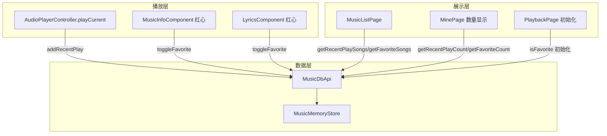

## 产品概述
为 Lucid Music 音乐播放器实现最近播放和收藏功能，让用户能够追踪播放历史和收藏喜欢的歌曲。

## 核心功能
- **最近播放**：每次播放歌曲时自动记录到最近播放列表，已有则移至最前（去重）
- **收藏歌曲**：播放页点击红心按钮 toggle 收藏/取消，加入或移除收藏列表
- **列表展示**：MinePage 的"本地"/"最近播放"/"收藏"三个入口各自展示对应数据
- **数量显示**：MinePage 快捷入口卡片显示真实的最近播放和收藏数量

## 技术栈
- 框架：HarmonyOS ArkUI (ArkTS)
- 状态管理：AppStorageV2 + @ObservedV2 / @Trace
- 数据持久化：MusicMemoryStore 内存单例（后续可扩展为数据库）

## 实现方案

### 架构设计

### 数据存储设计

在 `MusicMemoryStore` 中新增两个数组：
- `recentPlayIds: number[]` — 按最近播放顺序排列（最新在前），用于去重和排序
- `favoriteSongIds: number[]` — 收藏歌曲 ID 集合，无顺序要求

与现有 `songs: SongRow[]` 不同，这两个数组不存储完整歌曲数据，只存储 ID 引用，查询时通过 `getSongById` 解析为 DTO。

### 改动范围

| 文件 | 类型 | 说明 |
|------|------|------|
| `MusicMemoryStore.ets` | 修改 | 新增 recentPlayIds、favoriteSongIds 数组及操作方法 |
| `MusicDbApi.ets` | 修改 | 新增 8 个公开 API 方法 |
| `AudioPlayerController.ets` | 修改 | playCurrent 中调用 addRecentPlay |
| `MusicInfoComponent.ets` | 修改 | 红心持久化+切歌同步 |
| `LyricsComponent.ets` | 修改 | 红心持久化+切歌同步 |
| `PlaybackPage.ets` | 修改 | isFavorite 初始化从 MusicDbApi 读取 |
| `MusicListPage.ets` | 修改 | recent/favorite 数据加载 |
| `MinePage.ets` | 修改 | 真实计数 |

## 实现细节

### MusicMemoryStore — 存储层

新增字段：
- `recentPlayIds: number[]` — 最近播放 ID 列表
- `favoriteSongIds: number[]` — 收藏 ID 列表

新增方法：
- `addRecentPlay(id: number)` — 去重后插入头部（先 filter 移除已存在的，再 unshift）
- `getRecentPlayIds(): number[]` — 返回引用
- `toggleFavorite(id: number): boolean` — 存在则 splice 移除返回 false，否则 push 返回 true
- `isFavorite(id: number): boolean` — includes 检查
- `getFavoriteIds(): number[]` — 返回引用

### MusicDbApi — API 层

新增 8 个公开方法，委托给 MusicMemoryStore：
- `addRecentPlay(id)` — 记录最近播放
- `getRecentPlaySongs(): SongApiDto[]` — ID 列表 → DTO 列表（保持原序）
- `getRecentPlayCount(): number`
- `toggleFavorite(id): boolean` — toggle 并返回最终状态
- `isFavorite(id): boolean`
- `getFavoriteSongs(): SongApiDto[]`
- `getFavoriteCount(): number`

getRecentPlaySongs 和 getFavoriteSongs 复用现有的 `getSongById` 按 ID 顺序展开为 DTO。

### AudioPlayerController — 播放记录

在 `playCurrent()` 中，`loadAndPlay(url)` 调用后（无论是否成功），记录到最近播放。songItem.id 是可靠标识。

### MusicInfoComponent / LyricsComponent — 收藏持久化

当前问题：
1. `isFavorite` 仅存在 AppStorage 内存中，每次 `PlaybackPage` 进入都重置为 false
2. 切歌时（`selectIndex` 变化）`isFavorite` 不更新，仍显示上一首歌的收藏状态

修复：
- 为 `selectIndex` 添加 `@Watch('onSelectIndexChanged')`，切换时从 `MusicDbApi.isFavorite(id)` 读取并更新 `isFavorite`
- onClick 中 toggle `isFavorite` 后调用 `MusicDbApi.toggleFavorite(id)` 持久化，同时保留 `AVSessionController.updateFavoriteState` 调用
- `id` 来源：`this.songList[this.selectIndex].id`

### PlaybackPage — 收藏初始化

将第 37 行 `AppStorage.setOrCreate('isFavorite', false)` 改为从 MusicDbApi 读取。需要在 `aboutToAppear` 中根据当前 selectIndex 确定歌曲 ID 并查询收藏状态。由于 `syncToAppStorage` 中 `songList` 来自 `SongListData`（固定的 10 首），需要改用于确定当前歌曲 ID 的逻辑。最简单的方式：由于 `selectIndex` 已在 AppStorage 中初始化，可以直接使用 `MusicAppState.resolveSongAtQueueIndex` 获取当前 SongItem，再取 `id`。

实际上更简单：直接使用 `this.appState.resolveSongAtQueueIndex(this.appState.selectIndex)` 获取当前 SongItem，取其 id 查询 `MusicDbApi.isFavorite(id)`。

### MusicListPage — 按类型加载

将 `aboutToAppear` 中简单的 if/else 改为 switch，补充 recent 和 favorite 的数据来源。

### MinePage — 计数

`aboutToAppear` 中补充 `MusicDbApi.getRecentPlayCount()` 和 `getFavoriteCount()`。

