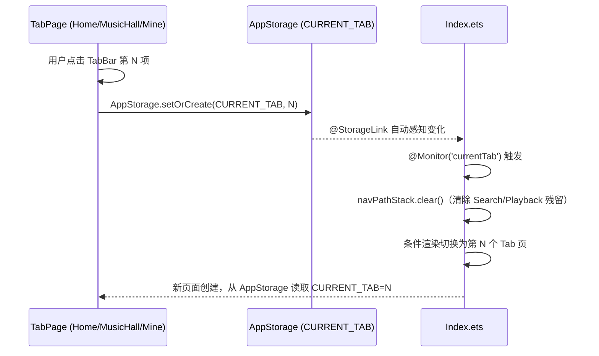

## 用户需求
将底部栏（MiniPlayerBar + LucidTabBar）从 Index 移回各 Tab 页面自身管理。Index 只保留 tab 切换逻辑（状态 + 条件渲染）和路由管理（Search/Playback push）。TabBar 的 onChange 直接写 AppStorage，Index 通过 @StorageLink 自动感知切换并 clear nav stack。

## 核心改动
- **Index.ets**：移除 MiniPlayerBar、LucidTabBar、screenWidth；@Local currentTab 改为 @StorageLink 双向绑定 AppStorage；新增 @Monitor 在 tab 切换时 clear navPathStack
- **HomePage / MusicHallPage / MinePage**：各自恢复底部 Stack 布局（MiniPlayerBar + LucidTabBar），TabBar onChange 写 AppStorage.CURRENT_TAB，MiniPlayerBar onTap push Playback

## 技术方案

### 通信机制

### 关键设计决策
1. **@StorageLink 双向绑定**：Index 使用 `@StorageLink('musichome_CurrentTab')` 替代 `@Local`，当任意页面的 TabBar 写 AppStorage 时，Index 自动重新渲染。ArkTS @ComponentV2 兼容该装饰器。
2. **@Monitor 清理路由栈**：Tab 切换时 `navPathStack.clear()`，防止 Search/Playback 页面残留。
3. **TabBar currentIndex 从 AppStorage 读取**：因条件渲染会重建页面组件，`AppStorage.get()` 总是读到最新值。
4. **各页独立管理底部栏**：恢复最初的 Stack 布局模式（内容 + 底部 Column{ MiniPlayerBar, LucidTabBar }），保持各页面自主性。

### 实现细节
- Index 不再 `pushPathByName('Home')`，根内容 `tabContent()` 直接条件渲染 HomePage
- 移除 `switchTab()` 方法和 `screenWidth` — 不再需要
- 移除 `LucidTabBar, MiniPlayerBar, display` 导入
- 各 Tab 页恢复 `display`, `MiniPlayerBar`, `LucidTabBar`, `AppStorageKeys` 导入
- MusicHallPage 和 MinePage 需新增 `@Consumer() navPathStack`（用于 Playback push）

