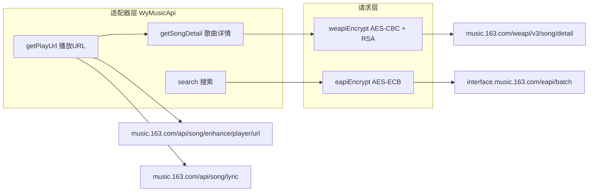

## 用户要求
对标 lx-music-mobile 完整重构网易云 API 集成，核心目标：
1. 实现 weapi 加密，通过 `/weapi/v3/song/detail` 获取歌曲封面
2. 修复 eapi 搜索/热搜的请求头，解决 HarmonyOS 上返回空的问题
3. 添加完整诊断日志，暴露 eapi/weapi 真实失败原因
4. 搜索加入未加密兜底路径，防止功能全部不可用

## 核心功能
- **weapi 封面获取**：播放时通过 weapi 请求网易云歌曲详情 API，从 `songs[0].al.picUrl` 提取封面 URL
- **eapi 搜索修复**：对齐 lx-music 请求头（User-Agent 补全 KHTML 标识、Accept、origin 小写）
- **诊断日志**：eapiRequest/weapiRequest 记录 httpCode、result 类型/长度、响应体前 200 字符
- **搜索兜底**：eapi 失败后自动回退到未加密 `https://music.163.com/api/search/get`


## 技术栈
- 语言: ArkTS (HarmonyOS)
- 网络: `@kit.NetworkKit` http
- 加密: `@kit.CryptoArchitectureKit` cryptoFramework
- 编码: `@kit.ArkTS` buffer + util.Base64Helper

## 架构设计

### 整体架构变换
```
重构前 (扁平式):
  WyMusicApi.search() → eapiRequest() → eapiEncrypt() → HTTP POST
  WyMusicApi.getPlayUrl() → GET (无封面)

重构后 (请求层 + 适配器层):
  请求层:  eapiRequest(url, data)     → eapiEncrypt()  → HTTP POST (interface.music.163.com)
          weapiRequest(url, data)    → weapiEncrypt() → HTTP POST (music.163.com)

  适配器:  WyMusicApi.search()       → eapiRequest → 解析 resources[].baseInfo.simpleSongData
          WyMusicApi.getSongDetail() → weapiRequest → 解析 songs[0].al.picUrl
          WyMusicApi.getPlayUrl()    → GET(URL+lyric) + getSongDetail(cover)
```

### 数据流


## 实现方案

### 1. MusicApiUtils.ets — weapi 加密

**新增 `weapiEncrypt(data: ESObject): Promise<{params: string, encSecKey: string}>`**

weapi 三步加密：

**步骤 1 — AES-CBC 一次加密：**
- 明文: `Buffer.from(JSON.stringify(data)).toString('base64')` — JSON 文本的 UTF-8 字节转 base64
- 密钥: `base64 解码 'MG8wUjBVMlJoUTBGbkl6MDljSGx6WTNKcGNIUWxNazQ5'`（即 `btoa('0CoJUm6Qyw8W8jud')`）
- IV: `base64 解码 'TVRJd01qQXdOVFV3TURjNE1EZz0='`（即 `btoa('0102030405060708')`）
- 模式: `AES128|CBC|PKCS7`

**步骤 2 — AES-CBC 二次加密：**
- 明文: 步骤 1 的 base64 结果
- 密钥: `base64 解码(generateRandomString(16))` — 随机 16 字符
- IV: 同步骤 1
- 模式: `AES128|CBC|PKCS7`

**步骤 3 — RSA 加密：**
- 明文: `reversed(randomKey)` 前补零至 128 字节 → base64
- 密钥: PEM 公钥字符串 → DER 解码 → Uint8Array → `createAsyKeyGenerator('RSA1024')` → `convertKey(DataBlob, null)` → PubKey
- 模式: `RSA1024|NoPadding`
- 输出: base64 解码结果 → bytesToHex

**返回:** `{ params: base64(步骤2), encSecKey: hex(步骤3) }`

**新增辅助函数：**
- `generateRandomString(len: number): string` — 随机字母数字串
- `derDecodePemPublicKey(pem: string): Uint8Array` — PEM → DER
- `rsaEncryptNoPadding(data: Uint8Array, pubKey): Promise<Uint8Array>` — RSA-1024-NoPadding
- `aesCbcEncrypt(b64Input: string, keyBase64: string, ivBase64: string): Promise<string>` — AES-CBC-PKCS7 加密

### 2. WyMusicApi.ets — 完整重构

**新增 `weapiRequest(path, data): Promise<Record<string, Object> | null>`**
- 调用 `weapiEncrypt(data)` 获取 `{params, encSecKey}`
- POST `https://music.163.com/weapi/${path}` (注意：weapi 端点是 `music.163.com`，不是 `interface.music.163.com`)
- Form 数据: `params=${encodeURIComponent(params)}&encSecKey=${encodeURIComponent(encSecKey)}`
- Headers: User-Agent(完整) + Referer + origin(小写)

**新增 `getSongDetail(songId: string): Promise<Record<string, Object> | null>`**
- 调用 `weapiRequest('v3/song/detail', {c: '[{"id":${songId}}]', ids: '[${songId}]'})`
- 返回 `response.songs[0]` 完整歌曲对象

**修改 `search(keyword, page, limit)`：**
- 主路径: eapiRequest `/api/search/song/list/page`（封面直接返回在 `al.picUrl`）
- 兜底: eapi 失败 → 未加密 GET `https://music.163.com/api/search/get`
- 兜底解析旧版数据结构: `result.songs[]` 的 `name/artists/album.name/duration/privilege`

**修改 `mapList()`：**
- 主逻辑不变（解析 `baseInfo.simpleSongData`）
- 封面缺失的判断改为：`picUrl` 为空 且 songId 有效 → 标记需要批量补封面
- 新增 `fillMissingCovers(results)` 批量调 `getSongDetail()` 补封面

**修改 `getPlayUrl(songId)`：**
- 获取播放 URL（不变，未加密 API）
- 获取歌词（不变，未加密 API）
- **封面改为 weapi 获取**: `getSongDetail(songId)` → `songs[0].al.picUrl`
- 返回 `{ url, lyrics, cover }`（cover 从 weapi 获取）

**修改 `eapiRequest(path, data)`：**
- 修复 User-Agent: 补全 `(KHTML, like Gecko)`
- 添加 `Accept: application/json`
- `Origin` → `origin`（小写）
- 添加诊断日志: httpCode / result类型 / 前200字符 / 异常详情

**修改 `hotSearch()`：**
- 使用 `eapiRequest` 请求 `/api/search/chart/detail`
- 添加诊断日志
- 失败返回 `[]`（触发 SearchViewModel 已有默认兜底链）

## 性能分析

| 场景 | 修改前 | 修改后 |
|------|--------|--------|
| 搜索 (eapi 可用) | 1 次 POST（无封面）| 1 次 POST（含封面）|
| 搜索 (eapi 不可用) | 1 次 POST 失败 → 空 | 2 次请求（POST尝试 + GET兜底）|
| 播放封面 | 0 次（无封面来源）| 0~1 次 weapi POST |
| 热搜 | 1 次 POST（失败）| 1 次 POST + 默认兜底 |

## 目录结构
```
features/search/src/main/ets/service/
├── MusicApiUtils.ets           # [MODIFY] 新增 weapiEncrypt + RSA/AES-CBC 辅助函数
└── platform/
    └── WyMusicApi.ets          # [MODIFY] 新增 weapiRequest/getSongDetail，修复 eapiRequest/getPlayUrl，诊断日志
```

