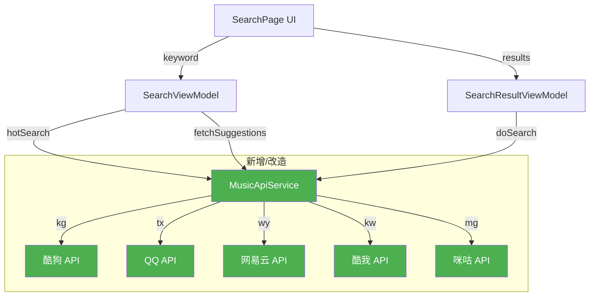

## 用户需求
让 lucid_music 音乐播放器的搜索功能完全可用，包括三个方面的真实数据接入：

### 搜索结果
- 当前状态：`MusicApiService.searchSongs()` 仅返回空数组，`SearchResultViewModel.doSearch()` mock 生成 15 条假数据
- 目标：移植 MusicHome 项目的 5 平台音乐搜索 API（酷狗/QQ/网易云/酷我/咪咕），支持平台切换真实搜索，搜索结果展示歌曲名、歌手、专辑、时长、封面等完整信息

### 热门搜索
- 当前状态：`SearchViewModel.hotSearches` 硬编码 6 个歌手名
- 目标：接入真实热门搜索 API，按当前选中平台动态获取热门搜索词列表

### 搜索建议（联想提示）
- 当前状态：`SearchViewModel.fetchSuggestions()` mock 生成 keyword+后缀的假数据
- 目标：接入真实搜索建议 API，输入关键词时实时返回联想结果（歌曲/歌手/专辑分类）


## 技术选型

- **语言**：ArkTS（HarmonyOS 原生开发语言）
- **网络请求**：`@ohos.net.http`（HarmonyOS HTTP 模块）
- **架构模式**：MVVM（ViewModel 管理状态 + Service 层封装 API）
- **数据源**：直接调用各音乐平台公开 HTTP API

## 实现方案

### 总体策略

**核心思路**：直接从 MusicHome 项目移植完整的 `MusicApiService`（5 平台搜索 API），然后在此基础上扩展热门搜索和搜索建议功能。MusicHome 与 lucid_music 同为 HarmonyOS 项目，API 调用方式、数据模型、平台枚举完全一致，移植成本最低且已验证可用。

**为什么选择直接移植 + 扩展**：
1. MusicHome 的 `MusicApiService` 已经过验证，5 个平台的搜索、歌词、封面、播放 URL 全部实现
2. 两个项目的平台枚举（kg/tx/wy/kw/mg）和 `SearchResultItem` 字段语义一致
3. 热门搜索和搜索建议在参考项目中未实现，需要在移植基础上新增——正好贴合本项目已有的三态 UI（热门/联想/结果）

### 关键技术决策

1. **搜索 API 来源**：移植 MusicHome 的 `MusicApiService`，保留其完整的 5 平台 HTTP 调用逻辑和各平台独特的参数/响应格式处理
2. **热门搜索 API**：使用网易云音乐 `https://music.163.com/api/search/hot/detail`（无加密、GET 请求、返回结构简单），按平台扩展其他平台的热搜 API
3. **搜索建议 API**：使用酷狗 `https://searchtip.kugou.com/getSearchTip`（无加密、GET 请求），按平台扩展其他平台的联想 API
4. **数据模型扩展**：`SearchResultItem` 增加 `album/songId/source/duration/coverUrl/rawFields` 字段，对齐 MusicHome 模型
5. **分页支持**：搜索结果支持分页加载（当前 UI 无分页，先实现第一页，预留分页接口）

### 实现细节

#### 性能考量
- 搜索建议做 300ms 防抖，避免频繁 API 调用
- 平台切换时复用已有结果缓存（同关键词切换平台时跳过关键词变更的重复处理）
- HTTP 请求设置合理超时（10s）

#### 错误处理
- 网络异常时展示友好提示而非 crash
- API 返回异常时 fallback 到空列表，不阻塞 UI
- 保留现有 Logger 日志，便于调试

#### 兼容性
- 保持现有 SearchPage 三态 UI（HOT/SUGGESTING/RESULT）不变
- 保持路由机制（一镜到底转场、NavPathStack）不变
- 保持 `SearchInputArea` 共享组件接口不变
- `AudioSourceManager` 暂不接入搜索流程（延后到后续迭代），本次仅用内置 API

### 架构设计



## 目录结构

```
features/search/src/main/ets/
├── service/
│   └── MusicApiService.ets          # [MODIFY] 移植 MusicHome 的完整 5 平台搜索 API + 新增 hotSearch/suggest
│       功能：封装酷狗/QQ/网易云/酷我/咪咕的搜索、热门搜索、搜索建议 HTTP 调用
│       实现要点：
│       - 从 MusicHome 移植 search/searchKugou/searchQQ/searchNetease/searchKuwo/searchMigu
│       - 新增 hotSearch(platform) → string[]，调用平台热门搜索接口
│       - 新增 suggest(keyword, platform) → SuggestionItem[]，调用平台联想建议接口
│       - 日志使用 Logger.info/warn/error（与现有代码一致）
│       - 错误处理：try-catch + fallback 空数组
├── model/
│   ├── SearchResultItem.ets         # [MODIFY] 扩展数据模型，对齐 MusicHome
│   │   新增字段：album(专辑), songId(平台歌曲ID), source(来源平台), duration(时长mm:ss), coverUrl(封面URL), rawFields(原始字段)
│   │   保留兼容字段：title→name映射, singer不变, url保留但暂不使用
│   └── SuggestionItem.ets           # [MODIFY] 扩展联想建议模型
│       新增字段：songId(可选), artistName(可选), albumName(可选)
│       保留现有：text, type, highlightText
├── viewmodel/
│   ├── SearchViewModel.ets          # [MODIFY] 接入真实热门搜索和联想建议
│       改动：
│       - 新增 initHotSearches() 调用 MusicApiService.hotSearch(currentPlatform)
│       - fetchSuggestions() 改为调用 MusicApiService.suggest(keyword, currentPlatform)
│       - 新增平台切换时刷新热门搜索
│       - 联想建议添加 300ms 防抖
│       - 保留搜索历史逻辑不变
│   └── SearchResultViewModel.ets    # [MODIFY] 接入真实搜索结果
│       改动：
│       - doSearch() 改为调用 MusicApiService.search(keyword, platform, page=1)
│       - 新增 loadMore(page) 分页方法（预留，UI 暂不触发）
│       - 保留 playSong/playNext/playLater 逻辑，适配新模型字段
└── view/
    └── SearchPage.ets               # [MODIFY] 更新 UI 适配新数据模型
        改动：
        - 热门搜索按平台动态获取，页面 onAppear 时触发
        - 搜索结果列表展示专辑名、时长等新字段
        - 保留现有三态切换逻辑和四点菜单
        - 保留一镜到底转场和平台切换按钮
```

## 关键代码结构

### MusicApiService 新增方法签名

```typescript
// 热门搜索：按平台获取热门搜索词
public static async hotSearch(platform: string): Promise<string[]>

// 搜索建议：按关键词和平台获取联想列表
public static async suggest(keyword: string, platform: string): Promise<SuggestionItem[]>

// 搜索歌曲：从 MusicHome 移植（已有占位）
public static async searchSongs(keyword: string, platform: string, page?: number, limit?: number): Promise<SearchResultItem[]>
```

### SearchResultItem 扩展字段

```typescript
export class SearchResultItem {
  // 现有字段
  public id: number = 0
  public title: string = ''       // 保留，等价于 name
  public singer: string = ''
  public url: string = ''         // 保留，后续播放用
  public cover: string = ''       // 保留，等价于 coverUrl

  // 新增字段（对齐 MusicHome）
  public album: string = ''
  public songId: string = ''
  public source: string = ''
  public duration: string = ''
  public coverUrl: string = ''
  public rawFields: Record<string, Object> = {}
}
```

