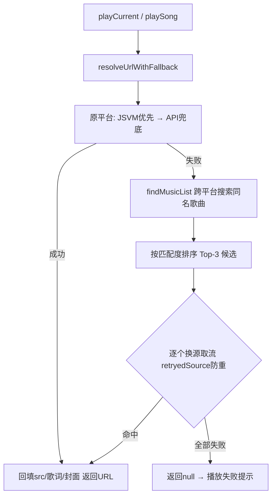

## 用户需求
酷狗(kg)平台有相当一部分歌曲取流失败后直接报"播放失败"，而 lx-music-mobile 会在取流失败时依次提示"获取播放链接 → 更换音源 → 重新获取播放链接 → 缓存中"并最终成功播放。要求对齐该"跨音源自动回退（换源）"机制；同时排查其余四个平台（网易云 wy / QQ tx / 酷我 kw / 咪咕 mg）是否存在同类问题。

## 产品概述
为在线歌曲取流增加"换源回退"能力：当首选平台取流失败时，自动跨平台搜索同名歌曲并逐个换源重试，全程显示与 lx 一致的中间状态文案；仅当所有候选音源均失败才报播放失败。该机制对所有平台通用，酷狗失效率最高的问题将被优先解决，其余四平台同步受益。

## 核心功能
- 取流失败自动换源：首选平台（JSVM+直连 API）取不到 URL 时，跨其余平台搜索同名歌曲，按匹配度排序后逐个换源取流。
- 中间状态提示：依次展示"正在获取播放链接..." → "正在更换音源..." → "重新获取播放链接..."，对齐 lx 体验；最终可播时进入缓冲（缓存中）。
- 防重复与防误匹配：用已尝试源集合避免回退死循环；仅采纳歌名匹配（含歌手匹配）的候选，限制候选数量以控制耗时。
- 展示信息保持原曲：换源仅借用其他平台的音频流/歌词/封面，歌曲标题与歌手仍展示原曲信息。
- 五平台统一修复：换源逻辑挂在公共取流入口，所有平台共用，无需逐平台改造。


## 技术栈
- 现有项目：HarmonyOS ArkTS（ArkUI V2 状态管理），无新增框架依赖。
- 复用既有能力：`musicSdk/index.ets` 已实现的 `searchMusic` / `findMusic` / `matchScore` / `pickBest`（即 lx `findMusic` 的等价物），这是本次换源匹配的核心基础，无需重写匹配算法。

## 实现方案
**策略**：在 `RemotePlayHelper` 抽出统一的 `resolveUrlWithFallback(platform, songId, title, singer, onProgress)` 方法——先走原平台（JSVM 优先 + 直连 API 兜底），失败则调用新增的 `musicSdk.findMusicList` 获取跨平台候选，逐个换源重试；通过 `onProgress` 回调把中间态回传给调用方（`AudioPlayerController` / `playSong`）以更新 `playbackStatus`。

**关键技术决策**：
1. **复用而非重写匹配**：`findMusicList` 在 `musicSdk/index.ets` 内基于已导出的 `searchMusic` 与私有 `matchScore` 实现，返回按分数降序、排除原平台、Top-3 的 `SearchResultItem[]`。保持匹配逻辑单一可信源（DRY）。
2. **换源仅借流不换曲**：回填 `src/lyricText/coverUrl` 到原 `SongItem`（或 `PlaybackIntentState.remoteUrl/remoteLyricText/remoteSongCover`），但标题/歌手维持原曲，与 lx 行为一致。
3. **中间态回调 `onProgress(status, message)`**：`playCurrent` 传入 `(s,m)=>this.syncPlaybackStatus(s,m)`；`playSong` 传入更新 `appState` 的回调。新增 `switching_source` 状态值（自由字符串，与现有 `requesting_url/preparing/error` 并列）。
4. **防死循环/防误匹配**：用 `retryedSource` 集合记录已尝试平台；候选仅采纳 `matchScore>=60`（歌名包含匹配）且排除原平台；上限 Top-3 以控制 5 平台并行搜索 + 最多 3 次取流的耗时（各平台 HTTP 已有 8s 超时）。
5. **音质降级暂不做**：当前各平台取流固定音质、JSVM 固定 128k，本次以"跨音源回退"为主线解决酷狗失败；音质降级（flac24bit→flac→320k→128k）列为可选增强，避免扩大改动面。

**性能与可靠性**：`findMusicList` 触发 5 平台并行搜索（单次播放代价，与 lx `getOtherSource` 一致）；候选 Top-3 限制最坏耗时约 3×8s=24s 上限，实际多数首源即命中。每个平台取流失败被 `.catch` 隔离，不影响其他候选。

## 实现注意事项
- **向后兼容**：`resolveUrlForQueue` 保留原签名并新增可选 `onProgress` 参数；无换源候选时回退到原"获取播放地址失败"提示，行为不变。
- **UI 兼容**：`MiniPlayerBar.ets` 第 89、127 行以 `status === 'requesting_url' || 'preparing' || 'error'` 判断状态行展示，需把 `switching_source` 纳入该条件，否则"正在更换音源..."不显示。
- **ArkTS 严格模式**：`findMusicList` 返回 `SearchResultItem[]`（class，可构造）；避免对象字面量赋给纯方法接口。
- **日志**：换源成功/失败记录 `platform→candidateSource` 与耗时，便于排查；避免打印大体积 URL/歌词。

## 架构设计
维持现有取流分层（Controller → RemotePlayHelper → AudioSourceExecutor/JSVM & ApiSource → 各平台 musicInfo），仅在 `RemotePlayHelper` 增加"换源回退"编排层，并复用 `musicSdk` 的匹配能力。不引入新架构模式。

调用链：


## 目录结构
```
common/musicbasic/src/main/ets/util/musicSdk/index.ets
  # [MODIFY] 新增导出函数 findMusicList(musicInfo: MusicInfo): Promise<SearchResultItem[]>
  # 复用 searchMusic + matchScore，返回排除原平台、按匹配度降序的 Top-3 候选（换源候选列表）。

common/musicbasic/src/main/ets/util/RemotePlayHelper.ets
  # [MODIFY] 重构取流：新增私有 resolveUrlWithFallback(platform, songId, title, singer, onProgress?)；
  # 原平台失败后用 findMusicList 跨平台换源逐个重试，onProgress 上报 "正在更换音源..."/"重新获取播放链接..."；
  # resolveUrlForQueue(song, onProgress?) 与 playSong(item) 共用该逻辑，换源成功回填歌词/封面。

features/player/src/main/ets/controller/AudioPlayerController.ets
  # [MODIFY] playCurrent 调用 resolveUrlForQueue 时传入 onProgress 回调 => syncPlaybackStatus，
  # 使换源中间态可见；取流最终失败仍走原 error 分支（"获取播放地址失败"）。

common/musicbasic/src/main/ets/components/miniplayer/MiniPlayerBar.ets
  # [MODIFY] 第 89、127 行状态行判断条件增加 'switching_source'，使"正在更换音源..."正常展示。
```

## 关键代码结构
```ets
// musicSdk/index.ets —— 新增导出
export async function findMusicList(musicInfo: MusicInfo): Promise<SearchResultItem[]>

// RemotePlayHelper.ets —— 新增私有编排方法（签名）
private static async resolveUrlWithFallback(
  platform: string,
  songId: string,
  title: string,
  singer: string,
  onProgress?: (status: string, message: string) => void
): Promise<{ url: string; lyrics: string; cover: string } | null>
```

