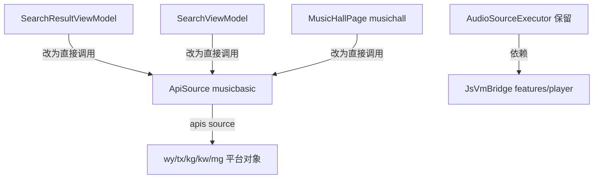

## 用户需求
清理 `features/search/service` 下的冗余层，使搜索功能直接依赖 musicSdk 已导出的公共端口 `ApiSource`，消除重复的透传封装与重复的加密工具文件。

## 核心任务
- 删除 `features/search/service/MusicApiUtils.ets`（其 crypto 已复制进 musicSdk，feature 内仅被用作 `PlayUrlResult` 类型来源，crypto 无人调用）。
- 删除 `features/search/service/MusicApiService.ets`（仅为 `ApiSource` 的透传壳，多出 `defaultHotSearches()`/`searchSongs()` 两个方法），并把这两个方法并入 `musicSdk/ApiSource.ets`。
- 调用方（`SearchViewModel`、`SearchResultViewModel`、`MusicHallPage`）改为从 `musicbasic` 直接导入并使用 `ApiSource`；`PlayUrlResult` 类型改从 `musicbasic` 导入。
- 删除 `features/search/Index.ets` 中 `MusicApiService` 的 re-export，保留 `AudioSourceExecutor`。
- 删除残留空目录 `features/search/service/platform/`。
- `AudioSourceExecutor.ets` 保持不变（依赖 `features/player` 的 `JsVmBridge`，JSVM 引擎在 player 层，不能下沉到 musicbasic 也不能放 entry）。


## 技术栈
- HarmonyOS ArkTS/ETS（ArkUI V2），`common/musicbasic` 公共 HAR 作为唯一音源 SDK。
- 模块分层：`entry`（薄壳）→ `features/*`（search/musichall/player）→ `common/musicbasic`（依赖只能向下）。

## 实现方案
### 策略
将 feature 层冗余的 `MusicApiService`（透传壳）与 `MusicApiUtils`（重复 crypto + 类型）删除，把仅有的有效成员并入 musicSdk 已通过 `index.ets` 对外导出的 `ApiSource`，调用方直接依赖 `musicbasic` 的 `ApiSource`。所有方法签名与现有调用一一对应，属于机械替换，无行为变更。

### 关键技术决策
- `ApiSource` 已是 musicSdk 的公共端口（`common/musicbasic/Index.ets` 已导出），ViewModel 直接依赖它符合分层，不存在"泄漏内部细节"。
- `PlayUrlResult` 已由 `musicSdk/index.ets`（`export { PlayUrlResult } from './wy/utils/crypto'`）并经 `common/musicbasic/Index.ets` 导出，删除 `MusicApiUtils` 后类型从 `musicbasic` 取即可。
- `defaultHotSearches()`/`searchSongs()` 并入 `ApiSource` 作为静态方法；`searchSongs` 当前无外部调用，并入仅为 API 完整性。
- 外部消费者 `features/musichall/MusicHallPage.ets` 当前 `import { MusicApiService } from 'search'`，需同步改为 `import { ApiSource } from 'musicbasic'`。
- `AudioSourceExecutor` 保留：它 `import { JsVmBridge } from 'player'`，JSVM 原生引擎在 `features/player`，不可移动。

### 性能与可靠性
- 纯静态分发，无新增网络/计算开销；`Promise.all` 隔离单平台失败的既有逻辑不变。
- 删除重复 crypto 文件，消除两份 `eapi/weapi/zzcSign` 实现的维护分歧风险。

## 实现注意
- 删除前已确认全仓对 `MusicApiService` 的引用仅出现在 `features/search`（SearchViewModel/SearchResultViewModel/MusicApiService 自身/Index.ets）与 `features/musichall/MusicHallPage.ets`，无 entry 依赖。
- 替换时逐方法核对签名：`search/hotSearch/suggest/getPlayUrl/getPlaylists/getPlaylistTags` 在 `ApiSource` 与 `MusicApiService` 中签名一致；`defaultHotSearches()`/`searchSongs()` 迁移为 `ApiSource` 静态方法。
- 日志 TAG 沿用现有 `ApiSource`；不打印完整歌词/URL 大负载。
- 爆破半径控制：仅删除冗余层并平移调用，不改任何端点实现与返回结构（`ApiSource.search` 仍返回 `SearchResult` 包装）。

## 架构设计


## 目录结构
```
common/musicbasic/src/main/ets/util/musicSdk/
└── ApiSource.ets              # [MODIFY] 新增 static defaultHotSearches() 与 searchSongs()，并入原 MusicApiService 的有效成员

features/search/src/main/ets/
├── Index.ets                  # [MODIFY] 删除 MusicApiService 的 re-export，保留 AudioSourceExecutor
├── service/
│   ├── MusicApiUtils.ets      # [DELETE] 重复 crypto + 类型，类型改从 musicbasic 取
│   ├── MusicApiService.ets    # [DELETE] 冗余透传壳，成员并入 ApiSource
│   └── platform/              # [DELETE] 残留空目录
└── viewmodel/
    ├── SearchResultViewModel.ets  # [MODIFY] 从 musicbasic 导入 ApiSource/PlayUrlResult，替换 MusicApiService.search/getPlayUrl 调用
    └── SearchViewModel.ets        # [MODIFY] 从 musicbasic 导入 ApiSource，替换 hotSearch/suggest/defaultHotSearches 调用

features/musichall/src/main/ets/view/
└── MusicHallPage.ets          # [MODIFY] 从 musicbasic 导入 ApiSource，替换 getPlaylists/getPlaylistTags 调用（原 import 自 'search'）
```

## 关键代码结构
```typescript
// ApiSource.ets 新增（其余方法保持不变，均委托 apis(source)）
public static defaultHotSearches(): string[] {
  return ['周杰伦', '邓紫棋', '林俊杰', '陈奕迅', 'Taylor Swift', 'IU']
}

public static async searchSongs(keyword: string, platform?: string): Promise<SearchResult> {
  return ApiSource.search(keyword, platform || 'kugou', 1, 30)
}
```

