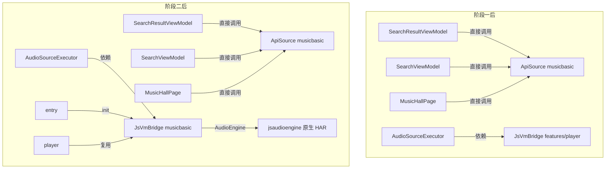

## 用户需求概述
将音源解析能力统一收敛到 `common/musicbasic` SDK，分两阶段推进，使 `entry`/`search`/`player` 统一从 SDK 取音源能力，消除 feature 间跨模块依赖与重复实现，各阶段目标 lint 0 错误。

## 核心功能
- 阶段一（机械替换，无行为变更）：删除 `features/search` 下冗余的 `MusicApiUtils.ets`（重复 crypto + 类型）与 `MusicApiService.ets`（ApiSource 透传壳），把仅有的有效成员（`PlayUrlResult` 类型、`defaultHotSearches()`、`searchSongs()`）并入 musicSdk 的 `ApiSource`；`SearchViewModel`/`SearchResultViewModel`/`MusicHallPage` 直接调用 `musicbasic` 导出的 `ApiSource`。
- 阶段二（架构下沉）：将 `JsVmBridge`（JSVM 音源脚本桥，含 `ScriptRequestResult`）从 `features/player` 下沉到 `common/musicbasic`，让 `entry`/`search`/`player` 统一从 SDK 取，消除 `search → player` 的跨 feature 依赖；`AudioSourceExecutor` 保留（其 `ExecutorPlayResult` 独立于 `ScriptRequestResult`）。
- 依赖约束：模块分层 `entry → features/* → common/musicbasic`，依赖只能向下；`musicbasic`（HAR）需验证可依赖原生模块 `jsaudioengine`（HAR）且无循环依赖，否则采用备选方案（shared 模块或运行时注入）。


## 技术栈选型
- HarmonyOS ArkTS/ETS（ArkUI V2：`@ObservedV2`/`@Trace`/`@ComponentV2`）
- `common/musicbasic` 公共 HAR 作为唯一音源 SDK
- 原生模块 `js_audio_engine`（仓库根级，HAR 类型，含 C++ JSVM via externalNativeOptions）提供 `AudioEngine` 实例
- 模块分层：`entry`（薄壳）→ `features/*`（search/musichall/player）→ `common/musicbasic`，依赖只能向下

## 实现方案
### 策略
阶段一为机械替换：删除冗余层、平移调用、把两个便捷方法并入 `ApiSource`，无行为变更。阶段二为架构下沉：把仅依赖 `musicbasic` + 原生模块的 `JsVmBridge` 移入 SDK，三方消费方改从 `musicbasic` 导入。

### 关键技术决策（均已代码核实）
- `ApiSource` 已通过 `musicSdk/index.ets` 并经 `common/musicbasic/Index.ets` 作为公共端口导出，ViewModel 直接依赖符合分层，不泄漏内部细节。
- `PlayUrlResult` 已由 `musicSdk/index.ets`（`export { PlayUrlResult } from './wy/utils/crypto'`）并经 `common/musicbasic/Index.ets` 导出；`MusicApiUtils.ets` 经 grep 确认**仅被 `MusicApiService.ets` 以 `import type` 引用**，musicSdk 各平台 `crypto.ets` 的 `TAG='MusicApiService'` 仅为陈旧注释（独立副本），删除 `MusicApiUtils.ets` 安全。
- `JsVmBridge` 现状仅依赖 `AudioEngine`（`jsaudioengine`）与 `Logger`（`musicbasic`），无 player 内部依赖；消费方为 `entry`（init）、`search`（`AudioSourceExecutor`）、`player`（仅 re-export），具备下沉条件。
- `js_audio_engine` 为 `module.json5` 中 `"type": "har"`、`oh-package.json5` 中 `dependencies: {}`，不反向依赖 `musicbasic`/`player`，无循环依赖；`musicbasic` 阶段二增加 `jsaudioengine: 'file:../../js_audio_engine'` 依赖。

### 性能与可靠性
- 纯静态分发与模块重定位，无新增网络/计算开销；`Promise.all` 隔离单平台失败的既有逻辑不变。
- 删除重复 crypto 文件，消除两份 `eapi/weapi/zzcSign` 实现的维护分歧风险。
- 下沉 `JsVmBridge` 不改变其单例与引擎生命周期，`entry` 的 `init()` 调用时机不变。

### 阶段二风险与备选方案
- HAR（musicbasic）依赖含 native `.so` 的 HAR（jsaudioengine）时，原生库可能不被自动打包进最终 HAP。落地下沉后必须实际编译验证；若 `.so` 未打包：
  - 备选(a)：将 `jsaudioengine` 改为 `shared` 模块供 `musicbasic`/`player` 共享；
  - 备选(b)：将 `JsVmBridge` 的 `AudioEngine` 获取改为运行时注入（由 `entry` 初始化后注入 SDK 单例），避免模块级硬依赖。
- 子代理需在落地下沉前给出可行路径并编译验证后再定稿。

## 实现注意
- 阶段一删除 `MusicApiUtils.ets`/`MusicApiService.ets` 后，`SearchResultViewModel` 的 `import type { PlayUrlResult }` 必须改从 `'musicbasic'` 导入（类型已导出）。
- `features/search/Index.ets` 删除 `export { MusicApiService }` 行，保留 `AudioSourceExecutor` 等导出。
- 阶段二改 `player/Index.ets` 为 `export { JsVmBridge, ScriptRequestResult } from 'musicbasic'`，保持 player 公共 API 稳定，避免破坏其它潜在引用。
- 阶段二移除 `features/search` 的 `player` 依赖前，必须先 grep 确认 `features/search` 内无其它 `from 'player'` 引用（当前仅 `AudioSourceExecutor` 一处）。
- 删除空目录 `features/search/src/main/ets/service/platform/`（git 已删其下文件）。

## 架构设计


## 目录结构
```
common/musicbasic/src/main/ets/
├── util/musicSdk/ApiSource.ets     # [MODIFY] 新增 static defaultHotSearches() 与 searchSongs()
├── service/JsVmBridge.ets          # [NEW] 阶段二：从 features/player 下沉，含 ScriptRequestResult 接口
└── Index.ets                       # [MODIFY] 阶段二导出 JsVmBridge / ScriptRequestResult；阶段一仅 musicSdk 已导出
common/musicbasic/oh-package.json5  # [MODIFY] 阶段二增加 jsaudioengine 依赖（验证可行后）

features/search/src/main/ets/
├── Index.ets                       # [MODIFY] 删除 MusicApiService re-export，保留 AudioSourceExecutor
├── service/
│   ├── MusicApiUtils.ets           # [DELETE] 重复 crypto + 类型（仅被 MusicApiService 引用）
│   ├── MusicApiService.ets         # [DELETE] 冗余透传壳，成员并入 ApiSource
│   ├── platform/                   # [DELETE] 残留空目录
│   └── AudioSourceExecutor.ets     # [MODIFY] 阶段二：JsVmBridge 改从 musicbasic 导入
├── viewmodel/
│   ├── SearchResultViewModel.ets   # [MODIFY] 从 musicbasic 导入 ApiSource/PlayUrlResult，替换调用
│   └── SearchViewModel.ets         # [MODIFY] 从 musicbasic 导入 ApiSource，替换调用
features/search/oh-package.json5    # [MODIFY] 阶段二确认无 player 引用后移除 player 依赖

features/musichall/src/main/ets/view/MusicHallPage.ets  # [MODIFY] 从 musicbasic 导入 ApiSource 替换 MusicApiService

features/player/src/main/ets/
├── service/JsVmBridge.ets          # [DELETE] 已下沉到 musicbasic
└── Index.ets                       # [MODIFY] 改为从 musicbasic re-export JsVmBridge / ScriptRequestResult

entry/src/main/ets/
├── entryability/EntryAbility.ets   # [MODIFY] JsVmBridge 改从 musicbasic 导入
└── pages/Index.ets                 # [MODIFY] JsVmBridge 改从 musicbasic 导入（其余 player 导入保留）
```

## 关键代码结构
```typescript
// ApiSource.ets 新增（其余方法保持不变，均委托 apis(platformToId(platform))）
public static defaultHotSearches(): string[] {
  return ['周杰伦', '邓紫棋', '林俊杰', '陈奕迅', 'Taylor Swift', 'IU']
}
public static async searchSongs(keyword: string, platform?: string): Promise<SearchResult> {
  return ApiSource.search(keyword, platform || 'kugou', 1, 30)
}

// JsVmBridge.ets 下沉到 musicbasic（接口与单例语义不变）
export interface ScriptRequestResult {
  source?: string
  action?: string
  data?: Record<string, Object>
  url?: string
}
export class JsVmBridge {
  private static instance: JsVmBridge | null = null
  private engine: AudioEngine = AudioEngine.getInstance()
  public static getInstance(): JsVmBridge { /* 单例 */ }
  public async init(): Promise<void> { await this.engine.init() }
  public async sendRequest(source: string, action: string, info: Record<string, Object>): Promise<ScriptRequestResult | null> { /* ... */ }
}
```

